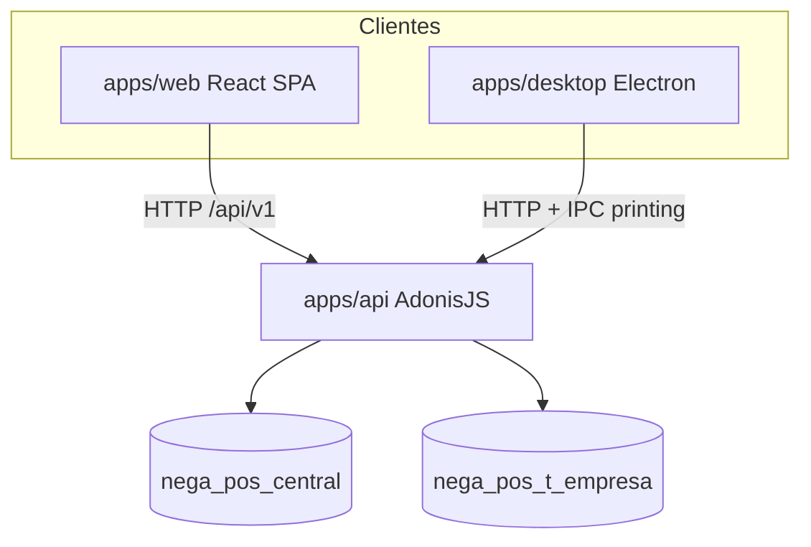

# Documentación oficial técnica — Nega POS

Referencia técnica **única y vigente** para desarrolladores. Derivada exclusivamente del código fuente del repositorio (`apps/`, migraciones, rutas, configuración). Última revisión contra el código: julio 2026.

> **Nota:** La carpeta `docs/` está descontinuada. No usar esos archivos como referencia; usar solo este documento y el código.

---

## Índice

1. [Resumen del sistema](#1-resumen-del-sistema)
2. [Arquitectura](#2-arquitectura)
3. [Stack tecnológico](#3-stack-tecnológico)
4. [Estructura del repositorio](#4-estructura-del-repositorio)
5. [Entornos de ejecución](#5-entornos-de-ejecución)
6. [Autenticación y seguridad](#6-autenticación-y-seguridad)
7. [Modelo de datos](#7-modelo-de-datos)
8. [Flujos de negocio (técnico)](#8-flujos-de-negocio-técnico)
9. [API REST — referencia](#9-api-rest--referencia)
10. [Frontend web](#10-frontend-web)
11. [App desktop e impresión](#11-app-desktop-e-impresión)
12. [Pruebas](#12-pruebas)
13. [Comandos de desarrollo](#13-comandos-de-desarrollo)

---

## 1. Resumen del sistema

**Nega POS** es un sistema de punto de venta y gestión de inventario con módulos administrativos. El monorepo implementa:

| Módulo | Descripción técnica |
|--------|---------------------|
| **Ventas** | Facturas en borrador → confirmación → descuento de stock (`SALE_OUT`), contado/crédito, devoluciones, modo rápido vs pedido |
| **Pedidos** | Órdenes con estados, líneas de catálogo, materiales asociados y transiciones con descuento de stock |
| **Catálogo** | Productos físicos y **servicios** (`item_kind`), fórmulas de materiales, categorías, precios; stock solo en productos |
| **Inventario** | Materiales con movimientos (`inventory_movements`) y productos con movimientos (`product_inventory_movements`) |
| **Compras** | Borrador → ítems → confirmar → entrada `PURCHASE_IN` a materiales o productos |
| **Partners** | Clientes y proveedores con abonos de crédito y estado de cuenta |
| **Financiero** | Cuentas, monedas, métodos de pago, gastos e ingresos operativos |
| **Máquinas** | Activos y gastos asociados (reparación, insumos, mantenimiento) |
| **Reportes** | Estado de cuenta consolidado por período |
| **Dashboard** | KPIs diarios, cierre, productos vendidos, gastos |
| **Impresión** | Tickets térmicos (factura, nota de despacho, comanda) vía Electron IPC |
| **Configuración** | Tasa de cambio, margen, datos generales del negocio, usuarios y permisos |

---

## 2. Arquitectura

Monorepo **pnpm** con clientes locales y API multi-empresa sobre MySQL.



**Dos planos de datos:**

| Plano | BD | Contenido |
|-------|-----|-----------|
| Control | `DB_CENTRAL_DATABASE` | `companies`, `directory_users`, `platform_admins` |
| Tenant | `nega_pos_t_<slug>` | Schema POS completo (ventas, stock, users operativos, etc.) |

**Flujo típico:**

1. Login global (`POST /auth/login` o Google) consulta el directorio central y fija en la sesión `tenantId` / `dbName` (sin reconsultar el directorio en cada request).
2. Middleware `tenant_context` cambia la conexión Lucid al MySQL de la empresa.
3. La SPA llama `/api/v1` con cookies; los datos nunca cruzan entre tenants.
4. Super admin en `/platform` provisiona empresas al instante (sin email/OTP): `CREATE DATABASE` → migrate → seed mínimo (FinancialBase + Admin).

---

## 3. Stack tecnológico

### Raíz (`package.json`)

| Componente | Versión / nota |
|------------|----------------|
| Node.js | ≥ 20 |
| pnpm | 9.15.4 (packageManager) |
| TypeScript | ^5.7.3 |
| ESLint + Prettier | ^9 / ^3 |

### API (`apps/api/package.json`)

| Paquete | Versión |
|---------|---------|
| @adonisjs/core | ^7.3.1 |
| @adonisjs/lucid | ^22.4.2 |
| @adonisjs/auth | ^10.1.0 |
| @adonisjs/session | ^8.1.0 |
| @adonisjs/shield | ^9.0.0 |
| @adonisjs/cors | ^3.0.0 |
| @adonisjs/drive | ^4.0.0 |
| @vinejs/vine | ^4.3.1 |
| mysql2 | ^3.14.0 |
| luxon | ^3.7.2 |
| Tests | Japa (@japa/runner, @japa/plugin-adonisjs) |

### Web (`apps/web/package.json`)

| Paquete | Versión |
|---------|---------|
| React | ^19.2.6 |
| react-router-dom | ^7.15.1 |
| @tanstack/react-query | ^5.100.14 |
| axios | ^1.16.1 |
| Vite | ^8.0.14 |
| Tailwind CSS | ^4.3.0 |
| zod | ^4.4.3 (solo frontend) |
| Tests | Vitest ^4.1.5 |

### Desktop (`apps/desktop/package.json`)

| Paquete | Versión |
|---------|---------|
| Electron | ^34.2.0 |
| electron-builder | ^25.1.8 |
| Versión app | 1.0.5 |

### Base de datos

- **MySQL 8.4** (imagen Docker `mysql:8.4`)
- **Multi-empresa:** BD central (`DB_CENTRAL_DATABASE`, ej. `nega_pos_central`) + una BD MySQL por empresa (`nega_pos_t_<slug>`) en el mismo servidor. Activar con `MULTI_TENANT_ENABLED=true`.

---

## 4. Estructura del repositorio

```
nega-pos/
├── apps/
│   ├── api/                 # Backend AdonisJS 6/7
│   │   ├── app/
│   │   │   ├── controllers/ # Controladores HTTP
│   │   │   ├── models/      # Modelos Lucid (27 entidades)
│   │   │   ├── services/    # Lógica de dominio
│   │   │   ├── permissions/ # Catálogo y mapeo ruta→permiso
│   │   │   ├── validators/  # Vine
│   │   │   └── transformers/
│   │   ├── database/
│   │   │   ├── migrations/          # Schema tenant (POS)
│   │   │   ├── migrations_central/  # Schema control plane
│   │   │   └── seeders/             # TenantBootstrap = FinancialBase + Admin
│   │   └── start/
│   │       └── routes.ts    # Definición de rutas API
│   ├── web/                 # SPA React + Vite
│   │   └── src/
│   │       ├── features/    # Módulos por dominio
│   │       ├── pages/       # Páginas de rutas
│   │       └── routes/      # router.tsx
│   ├── desktop/             # Electron
│   │   ├── electron/        # main.ts, preload, print-service
│   │   └── print-config.json  # legacy (se migra a userData al arrancar)
│   └── mobile/              # Capacitor Android (APK; reutiliza web/dist)
├── docker-compose.yml       # MySQL + API opcional
├── scripts/                 # dev-setup.ps1, reset-database.ps1, build-mobile.ps1
└── package.json             # Scripts del monorepo
```

---

## 5. Entornos de ejecución

Hay **dos mundos separados**. No mezclarlos en el día a día.

| | Desarrollo / pruebas / PRs | Producción |
|--|----------------------------|------------|
| API + MySQL | Docker en esta máquina (`localhost:3333` / `:3306`) | Railway (`nega-pos-api-production…`) |
| Web | `pnpm dev:web` → **siempre** `VITE_API_URL=http://localhost:3333` | No se despliega; clientes usan builds |
| Desktop / APK | Solo si querés probar el instalador contra local (cambiar URL) | Build con URL de Railway |
| Datos | BD local (`nega_pos` / `nega_pos_central` / tenants locales) | BD de Railway (clientes reales) |
| Flujo Git | rama → prueba local → **PR** → merge a `main` | Deploy API en Railway tras merge |

`pnpm dev:web` **bloquea** si `apps/web/.env` apunta a Railway u otra HTTPS remota (`scripts/assert-dev-api-local.mjs`).

### Local con Docker (MySQL + API)

```powershell
docker compose up -d          # MySQL + API → localhost:3333   (alias: pnpm dev:stack)
# o
docker compose up -d mysql    # Solo BD → localhost:3306       (alias: pnpm dev:db)
# y API en el host:
pnpm dev:api
```

Credenciales alineadas con `apps/api/.env.example`: usuario `nega_pos`, BD `nega_pos`.

Arranque típico de trabajo diario:

```powershell
pnpm dev:stack                # o abrir Docker Desktop y luego compose
pnpm dev:web                  # http://localhost:5173 → proxy /api → :3333
```

Tests API: `cd apps/api; node ace test` contra **`nega_pos_test`** (nunca producción ni `nega_pos` de desarrollo).

### Desarrollo en host

| Servicio | Puerto | Comando |
|----------|--------|---------|
| API | 3333 | `pnpm dev:api` o contenedor `nega-pos-api` |
| Web (Vite) | 5173 | `pnpm dev:web` |
| MySQL | 3306 | `pnpm dev:db` / `pnpm dev:stack` |

### Desktop

- Servidor estático embebido en `127.0.0.1:51740`
- Build: `pnpm build:desktop` o desarrollo: `pnpm dev:desktop`
- Configuración de impresión: **fuente de verdad en MySQL** (`app_settings` key `print_config` vía `GET/PUT /api/v1/settings/printing`). El JSON local en userData solo sirve para **importación one-shot** al primer arranque si la BD está vacía.
- API de **release**: `apps/desktop/api-url.json` (URL de Railway). No usar ese JSON como fuente para `dev:web`.

### Mobile APK (Capacitor)

- Workspace: `apps/mobile` (WebView de `apps/web/dist`; **no** altera el pipeline desktop)
- Habla con la **API pública HTTPS** (`VITE_API_URL` al buildear); cookies cross-origin (`SameSite=None; Secure` en producción)
- CORS: setear `MOBILE_APP_ORIGIN=https://localhost` en la API (Railway / `.env`)
- Build de release: `$env:VITE_API_URL="https://tu-api"; pnpm build:mobile` luego `pnpm --filter mobile build:apk:release`
- Detalle: [`apps/mobile/README.md`](apps/mobile/README.md)
- Impresión térmica es **exclusiva del desktop**; la config de impresión se ve/edita también desde el navegador vía API

### Despliegue Railway (solo API + MySQL)

**Railway despliega únicamente la API y MySQL de producción.** No es el target de `pnpm dev:web`.

Guía operativa histórica: `docs/RAILWAY_DEPLOY.md` (carpeta `docs/` descontinuada como fuente de verdad; preferir esta sección).

| En Railway (prod) | En esta PC (dev) |
|-------------------|------------------|
| `nega-pos-mysql` | Docker `nega-pos-mysql` |
| `nega-pos-api` | Docker `nega-pos-api` o `pnpm dev:api` |
| — | Web: `pnpm dev:web` → `http://localhost:3333` |
| — | Desktop/APK release: URL Railway al buildear |

| Pieza | Ubicación |
|-------|-----------|
| Dockerfile + entrypoint | `apps/api/Dockerfile`, `apps/api/bin/docker-entrypoint.sh` |
| Config Railway | `apps/api/railway.toml` (solo servicio API) |
| Vars plantilla | `apps/api/.env.railway.example` |
| Seed seguro | `node ace db:bootstrap` — platform admin en central (multi-tenant) o admin tenant si legacy |
| Uploads persistentes | Volume `/data/uploads` + `STORAGE_LOCAL_PATH=/data/uploads` (paths `t_<companyId>/…`) |

**Reglas prod:** no crear servicio web en Railway; pre-deploy migra **central y todos los tenants** (`migration:run_central` + `migration:run_tenants`); empresas nuevas se crean desde `/platform` (`CREATE DATABASE` + migrate + seed, sin OTP). Si un tenant falla en pre-deploy, Railway aborta el deploy (revisar logs: slug / `db_name` / error). Desde `/platform` también se puede **suspender** o **eliminar por completo** una empresa (DROP de su MySQL + filas en central + uploads); la eliminación pide confirmar el slug.

**Flujo con PRs:** trabajar en rama contra Docker local → abrir PR a `main` → merge → Railway redeploya la API. Los instaladores desktop/mobile se regeneran cuando haga falta con la URL de prod.

### Cutover multi-empresa (producción limpia)

1. Wipe MySQL actual (borrar/recrear plugin o `DROP DATABASE`).
2. Crear `nega_pos_central`; set `DB_CENTRAL_DATABASE`, `MULTI_TENANT_ENABLED=true`.
3. El user MySQL debe poder `CREATE DATABASE`.
4. Redeploy API → migraciones central + tenants (si hay) + bootstrap platform admin.
5. Abrir web local → `/platform/login` → crear empresas (provision inmediato).
6. Login de usuarios de empresa en `/login` (email global, sin código de empresa).

### Variables de entorno relevantes

**API** (`apps/api/.env.example`):

| Variable | Propósito |
|----------|-----------|
| `APP_KEY` | Clave de aplicación Adonis |
| `PORT` / `HOST` | Puerto y bind (default 3333 / 0.0.0.0) |
| `SESSION_DRIVER` | `cookie` en dev |
| `SESSION_MAX_AGE` | Expiración por inactividad (ej. `365d`) |
| `DB_*` | Conexión MySQL (host/user compartidos) |
| `DB_CENTRAL_DATABASE` | BD control plane (`companies`, directorio, platform admins) |
| `MULTI_TENANT_ENABLED` | `true` = login global + BD por empresa; `false` = legacy single-DB (tests) |
| `FRONTEND_URL` | CORS web (ej. `http://localhost:5173`) |
| `DESKTOP_APP_ORIGIN` | CORS Electron (`http://127.0.0.1:51740`) |
| `MOBILE_APP_ORIGIN` | CORS Capacitor APK (`https://localhost`) |
| `ADMIN_EMAIL` / `ADMIN_PASSWORD` | Seeder admin tenant / defaults de provisión |
| `PLATFORM_ADMIN_EMAIL` / `PLATFORM_ADMIN_PASSWORD` | Super admin central (`db:bootstrap`) |
| `GOOGLE_CLIENT_ID` | Login Google (id_token) |
| `DRIVE_DISK` / `STORAGE_LOCAL_PATH` | Archivos subidos (imágenes, facturas). En Railway: Volume + `/data/uploads` |
| `RUN_MIGRATIONS_ON_START` | Solo Docker local/`docker-compose` (`true`). En Railway: `false` (usa pre-deploy) |
| `SKIP_BOOTSTRAP_SEED` | `true` para omitir `db:bootstrap` en el entrypoint |

**Web** (`apps/web/.env.example`):

| Variable | Propósito |
|----------|-----------|
| `VITE_API_URL` | **Dev:** `http://localhost:3333` (obligatorio para `pnpm dev:web`). **Release APK/desktop build:** URL HTTPS de Railway. Nunca mezclar prod en `.env` de desarrollo. |
| `VITE_GOOGLE_CLIENT_ID` | Mismo client id que la API (botón Continuar con Google) |

---

## 6. Autenticación y seguridad

### Sesión

- Guard `web` de Adonis Auth con **cookies** (`SESSION_DRIVER=cookie`).
- Login: `POST /api/v1/auth/login` → con multi-tenant: directorio central → sesión con `tenantId`/`tenantDb` → user en BD empresa. **No** se consulta el directorio en cada request.
- Google: `POST /api/v1/auth/google` `{ id_token }` (emails ya en `directory_users`).
- Logout: `POST /api/v1/auth/logout` (requiere sesión).
- Perfil: `GET /api/v1/auth/me`.
- Platform: `/api/v1/platform/*` + UI `/platform` (super admin, solo BD central).

### CSRF

- Token: `GET /api/v1/csrf` (público, sin auth).
- Las peticiones mutantes desde el frontend envían el token CSRF (Shield).

### Roles y permisos

**Roles** (`users.role`): `OPERATOR` | `ADMIN`.

- `ADMIN` tiene todos los permisos (`*`).
- `OPERATOR` tiene permisos granulares en `users.permissions` (JSON).

**Catálogo de permisos** (`apps/api/app/permissions/catalog.ts`, espejo en `apps/web/src/features/permissions/catalog.ts`):

| Grupo | Claves |
|-------|--------|
| dashboard | `dashboard.view` |
| ventas | `ventas.view`, `ventas.confirm`, `ventas.credit`, `ventas.returns` |
| customers | `customers.view`, `customers.edit`, `customers.payments` |
| suppliers | `suppliers.view`, `suppliers.edit`, `suppliers.payments` |
| catalog | `catalog.view`, `catalog.edit`, `catalog.pricing` |
| materials | `materials.view`, `materials.edit`, `materials.adjust` |
| machines | `machines.view`, `machines.edit` |
| purchases | `purchases.view`, `purchases.edit`, `purchases.confirm` |
| expenses | `expenses.view`, `expenses.edit` |
| incomes | `incomes.view`, `incomes.edit` |
| reports | `reports.view` |
| settings | `settings.view`, `settings.edit` |
| users | `users.view`, `users.manage` |

**Middleware** (`permission_middleware.ts`): resuelve permiso por método + ruta (`route_permissions.ts`). Rutas no mapeadas → `deny`. Excepciones solo auth: `/auth/me`, `/auth/logout`.

---

## 7. Modelo de datos

Migraciones tenant en `apps/api/database/migrations/`. Control plane en `database/migrations_central/` (`companies`, `directory_users`, `platform_admins`). Modelos Lucid en `apps/api/app/models/`.

Al provisionar una empresa: migraciones tenant + seed mínimo (USD como moneda base, monedas/métodos iniciales editables + admin). **Sin** categorías ni proveedores de demo. Cada empresa configura luego su propia moneda base y catálogo financiero.

### Agrupación de tablas

#### Usuarios

| Tabla | Campos clave |
|-------|--------------|
| `users` | `email`, `password`, `name`, `role` (OPERATOR/ADMIN), `permissions` (JSON), `active` |

#### Partners

| Tabla | Campos clave |
|-------|--------------|
| `customers` | `name`, `phone`, `email`, `type` (WHITE_LABEL/CORPORATE/OTHER), `document`, `credit_days`, `active` |
| `suppliers` | `name`, `rif`, `phone`, `email`, `credit_days`, `active` |

#### Financiero

| Tabla | Campos clave |
|-------|--------------|
| `accounts` | `name`, `description`, `is_active` |
| `currencies` | `code` (PK), `name`, `rate_per_usd` (unidades por 1 unidad de moneda base), `is_active` |
| `payment_methods` | `code`, `name`, `is_active`, `sort_order` |
| `app_settings` | `key` (PK); incluye `base_currency_code` (**por empresa**; en alta nueva default `USD`), tasa VES, margen, `business_profile`, `print_config` |
| `customer_payments` | `customer_id`, `order_id?`, `sale_id?`, `amount_usd` (monto en moneda base), `payment_method_code`, `account_id` |
| `supplier_payments` | `supplier_id`, `purchase_id?`, `amount_usd` (monto en moneda base), … |
| `expenses` | `account_id`, `supplier_id?`, `date`, `description`, `invoice_number?`, `amount_usd` (monto canónico en moneda base), `currency_code` (moneda de ingreso), `entry_rate` (unidades de moneda de ingreso por 1 de base; `null` si es base) |
| `incomes` | `account_id`, `date`, `description`, `amount_usd` (monto canónico en moneda base), `currency_code`, `entry_rate` — aportes / entradas de dinero |

**Moneda base:** configurable **por empresa** (`GET/PUT /api/v1/currencies/base`, permiso `settings.edit`). Al provisionar un tenant nuevo la base por defecto es **USD**; la empresa puede crear monedas/métodos de pago y cambiar la base. Semántica de tasas: *unidades de moneda por 1 unidad de base* (`base = nativo / tasa`, `nativo = base * tasa`). Las columnas `*_usd` conservan el nombre pero almacenan montos en la moneda base. (Cutover histórico a XAU aplica solo a BD con data transaccional previa.)

**Tasa por documento (gastos, ingresos, compras, cobro contado):** el monto se ingresa en una moneda activa; la tasa default es `currencies.rate_per_usd`. Si el usuario la cambia, queda solo en ese registro (`entry_rate` en gastos/ingresos, `usd_rate` en compras/ventas) y **no** modifica el catálogo ni Configuración.

#### Catálogo

| Tabla | Campos clave |
|-------|--------------|
| `categories` | `name`, `active`, `sort_order` |
| `formulas` | `name`, `active` |
| `formula_materials` | `formula_id`, `material_id`, `quantity` |
| `catalog_products` | `name`, `category`, `item_kind` (`PRODUCT`\|`SERVICE`, default `PRODUCT`), `sale_unit`, `formula_id?`, `sale_price_usd`, `cost_usd`, `stock_quantity`, `minimum_stock`, `active`. Los `SERVICE` no usan inventario/fórmula/tallas (`stock`/`minimum` en 0, `formula_id` null). |
| `catalog_product_sizes` | Tallas opcionales por producto: `catalog_product_id`, `size` (texto libre ≤20), `stock_quantity`; UNIQUE `(catalog_product_id, size)`. Si hay filas, el stock del producto es la suma de tallas. Incompatible con `formula_id`. |

Unidades de venta: `UND`, `PAR`, `CAJ`, `ROL`, `SET`, `MTS`, `KG`.

#### Inventario

| Tabla | Campos clave |
|-------|--------------|
| `materials` | `code`, `name`, `category` (FABRIC/THREAD/…), `unit`, `minimum_stock`, `default_supplier_id`, precios, `active` |
| `inventory_movements` | `material_id`, `type`, `quantity`, refs a compra/pedido/venta |
| `product_inventory_movements` | `catalog_product_id`, `type`, `quantity`, refs, `created_by_user_id` |

**Tipos de movimiento — materiales:** `PURCHASE_IN`, `ORDER_OUT`, `MANUAL_ADJUSTMENT`, `MANUAL_CARGO`, `MANUAL_DESCARGO`, `REVERSAL_ADJUSTMENT`, `SALE_OUT`.

**Tipos de movimiento — productos:** `PURCHASE_IN`, `SALE_OUT`, `MANUAL_ADJUSTMENT`, `MANUAL_CARGO`, `MANUAL_DESCARGO`, `REVERSAL_ADJUSTMENT`, `PRICE_CHANGE`.

#### Compras

| Tabla | Campos clave |
|-------|--------------|
| `purchases` | `supplier_id`, `account_id`, fechas, `invoice_number`, `status` (DRAFT/CONFIRMED/VOIDED), `is_credit`, `affects_inventory` (default true; false = factura financiera sin stock), totales USD/BS, saldos |
| `purchase_items` | `material_id?`, `catalog_product_id?`, cantidades y precios |

#### Pedidos

| Tabla | Campos clave |
|-------|--------------|
| `counters` | `scope` (PK), `value` — correlativos |
| `orders` | `code`, `customer_id?`, `guest_name`, `modality` (WHITE_LABEL/CORPORATE), `status`, `payment_type`, totales, fechas |
| `order_lines` | `catalog_product_id`, `catalog_product_size_id?`, `size?` (snapshot), `quantity`, precios, `returned_quantity`, `notes?` |
| `order_materials` | `material_id`, `quantity_per_garment` |

**Estados de pedido:** `DRAFT` → `CONFIRMED` → `IN_PRODUCTION` → `DELIVERED`; también `CANCELLED`, `RETURNED`.

#### Ventas

| Tabla | Campos clave |
|-------|--------------|
| `sales_shifts` | `opened_at`, `closed_at`, `opened_by_user_id`, `closed_by_user_id`, `status` (OPEN/CLOSED), `notes` |
| `sales` | `code`, `customer_id?`, `guest_name`, `sales_shift_id?`, `billing_mode` (FAST/ORDER), `order_status` (PENDING/IN_PROCESS/DELIVERED), `payment_type`, `status` (DRAFT/COMPLETED/RETURNED), `discount_usd` (descuento de factura, default 0), `total_usd` (subtotal de líneas − descuento) |
| `sale_lines` | `catalog_product_id?`, `catalog_product_size_id?`, `size?` (snapshot), `material_id?`, `description`, `kitchen_note?` (indicaciones de cocina para comanda), cantidades y precios |

**Turnos de venta:** solo puede haber un turno `OPEN`. Confirmar venta (`POST /sales/:id/confirm` o `POST /sales` con `confirm: true`) exige turno abierto; sin turno → `TURNO_NO_ABIERTO` (409). La venta confirmada guarda `sales.sales_shift_id`.

#### Máquinas

| Tabla | Campos clave |
|-------|--------------|
| `machines` | `name`, `type`, `brand`, `model`, `acquisition_cost`, `active` |
| `machine_expenses` | `machine_id`, `category` (REPAIR/SUPPLY/MAINTENANCE/OTHER), `amount`, `receipt_file` |

### Relaciones principales

```
customers ──< orders ──< order_lines ──> catalog_products
                └──< order_materials ──> materials
customers ──< sales ──< sale_lines ──> catalog_products | materials
sales_shifts ──< sales
suppliers ──< purchases ──< purchase_items ──> materials | catalog_products
formulas ──< formula_materials ──> materials
catalog_products ──> formulas (opcional)
catalog_products ──< catalog_product_sizes (opcional; stock por talla)
materials ──< inventory_movements
catalog_products ──< product_inventory_movements
```

---

## 8. Flujos de negocio (técnico)

### Compras (`purchase_service.ts`)

1. **Crear borrador** (`status: DRAFT`) con proveedor y cuenta opcional.
2. **Agregar ítems** — material y/o producto de catálogo (`PRODUCT`; productos con fórmula y servicios no admiten compra directa de stock).
3. **Confirmar** (`POST .../confirm`):
   - Requiere `invoice_number` y al menos un ítem (salvo `affects_inventory = false`).
   - Si `affects_inventory` es true (default): por cada ítem material → movimiento `PURCHASE_IN` + actualización de `last_purchase_price_usd`; por cada ítem producto sin fórmula → `PURCHASE_IN` en `product_inventory_movements` + `cost_usd`.
   - Si `affects_inventory` es false: no mueve stock (factura financiera / deuda sin mercadería).
   - `status → CONFIRMED`; si es crédito, registra saldo en proveedor.
   - Tras confirmar compra con stock, pedidos en `DRAFT` pendientes de material pueden pasar automáticamente a `IN_PRODUCTION` si hay stock suficiente.

### Factura desde ficha de proveedor (`supplier_invoice_service.ts`)

`POST /api/v1/suppliers/:id/invoices` (permiso `suppliers.payments`):

- **Contado** (`is_credit: false`): crea un `expense` con `supplier_id`, `account_id` obligatorio, `invoice_number` opcional. No toca inventario. Aparece en Gastos y en el estado de cuenta del proveedor.
- **Crédito** (`is_credit: true`): crea un `purchase` ya `CONFIRMED` con `affects_inventory: false`, sin ítems, `balance_usd = total`. El **Abono** existente baja ese saldo. No toca inventario. En Reportes/Dashboard aparece como **cuenta por pagar** (informativo; no afecta flujo de caja hasta el abono).

### Catálogo, fórmulas y tallas

- `item_kind`:
  - **`PRODUCT`** (default): producto físico vendible con inventario (manual, fórmula o tallas).
  - **`SERVICE`**: servicio sin inventario. Admin en `/productos/servicios`. Listados de productos/inventario/ajustes/compras de stock filtran o rechazan `SERVICE`. Serialización incluye `item_kind` e `is_service`. Filtro de listado: `?item_kind=PRODUCT|SERVICE` (si se omite, el listado de catálogo default es `PRODUCT`).
- Producto **con** `formula_id`: el stock de venta/pedido se descuenta de **materiales** según `formula_materials`, no de `stock_quantity`. No admite tallas. No aplica a `SERVICE`.
- Producto **sin** fórmula: stock en `catalog_products.stock_quantity` vía `product_inventory_movements`.
- Producto **con tallas** (`catalog_product_sizes`): stock por talla; `stock_quantity` del producto = suma. Ventas/pedidos exigen `catalog_product_size_id` o `size`; al confirmar se descuenta la talla y el total global (movimiento `SALE_OUT` con nota `… talla {size}`). Compras v1 no desglosan por talla. No aplica a `SERVICE`.
- API: create/update aceptan `sizes[]` y `item_kind`; `PUT /catalog-products/:id/sizes` reemplaza el set (`[]` limpia). Listado `?size=` filtra productos con esa talla y stock > 0. Serialización siempre incluye `has_sizes` + `sizes[]`.
- Ajustes manuales: `POST catalog-products/:id/adjustment`, `POST catalog-products/bulk-adjustment` (varios productos en una transacción) y `POST materials/:id/adjustment`. Los productos con tallas requieren `catalog_product_size_id`. Los productos con fórmula y los **servicios** no admiten ajuste manual de stock. Las ediciones de producto que cambian **stock** o **precio/costo** generan movimientos en `product_inventory_movements` (`MANUAL_ADJUSTMENT` / `PRICE_CHANGE`) con `created_by_user_id`; cambios de nombre/descripción no se registran.

### Pedidos (`order_service.ts` + `order_state_machine.ts`)

**Transiciones permitidas:**

| Desde | Hacia |
|-------|-------|
| DRAFT | CONFIRMED, DELIVERED, CANCELLED |
| CONFIRMED | IN_PRODUCTION, CANCELLED |
| IN_PRODUCTION | DELIVERED, CANCELLED |
| DELIVERED | — |
| CANCELLED / RETURNED | — |

**Efectos por transición:**

- **DRAFT → CONFIRMED**: valida cliente/invitado y descripción; congela costos; descuenta stock de productos de líneas; aplica pago si contado.
- **DRAFT → DELIVERED**: igual que confirmar + pasa a producción (descuento de materiales vía fórmulas/`order_materials`).
- **CONFIRMED → IN_PRODUCTION**: descuenta materiales (`ORDER_OUT`); puede advertir si falta stock (`force` opcional).
- **→ CANCELLED** desde CONFIRMED/IN_PRODUCTION: revierte movimientos y stock de productos.

### Ventas (`sale_service.ts`)

1. **Borrador** (`DRAFT`): líneas de catálogo (producto o **servicio**) o material, cliente opcional. En el POS de facturar hay tabs **Productos / Materiales / Servicios**; al confirmar, productos y materiales descuentan stock (`SALE_OUT`), los **servicios no mueven inventario**. Línea de servicio: `catalog_product_id` de un `SERVICE`, `quantity`, `unit_price_usd` editable y `description` opcional (detalle en factura; si falta, se usa el nombre del servicio). El precio unitario de cada línea es el enviado por el cliente (se puede cambiar en el carrito; atajos −5/−10/−20 % vs precio de lista). Si el producto tiene fórmula, se pueden ajustar materiales de esa venta. El descuento de factura (`discount_usd`) es independiente del precio por línea: `total_usd = suma(líneas) − discount_usd` (nunca negativo).
2. **Confirmar** (`POST .../confirm`):
   - Genera `code`, `status → COMPLETED`, `sold_at` / `confirmed_at`.
   - `billing_mode FAST` → `order_status DELIVERED`; `ORDER` → `order_status PENDING`.
   - Descuenta stock (producto directo, materiales de fórmula, o línea de material); **omite** líneas cuyo catálogo es `SERVICE`.
   - Aplica método de pago y saldo si es crédito.
3. **Transición de pedido de venta** (`billing_mode ORDER`): `PENDING → IN_PROCESS → DELIVERED` (solo ventas completadas).
4. **Devolución** (`POST .../return`): parcial o total; revierte stock de productos/materiales (no de servicios) y actualiza `RETURNED`.

### Reportes (`report_service.ts` / `inventory_report_service.ts`)

- **Estado de cuenta consolidado** (`GET /reports/account-statement`): agrega ventas, **ingresos** (aportes), compras de contado, abonos a proveedores, gastos, gastos de máquina y abonos de clientes en un rango de fechas, con filtros por cuenta, moneda de visualización y tipos (`sales`, `incomes`, `purchases`, `expenses`, `machine_expenses`). Balance neto (flujo de caja): `ventas + ingresos − compras_contado/abonos − gastos − gastos_máquina`. Las **cuentas por pagar** (compras/facturas a crédito con saldo) se listan como informativas (`pendingPayablesUsd` / `overduePayablesUsd`) y **no restan** del neto hasta el abono.
- **Inventario** (`GET /reports/inventory`): snapshot de stock de productos de catálogo (`item_kind=PRODUCT`) y materiales en una sola lista (paginada). Los servicios no aparecen. Filtros: `search`, `category`, `sort_by`/`sort_dir` (`id`|`name`|`sale_price`|`quantity`), `active`, `low_stock`, `hide_zero`, `page`, `per_page`, `export=true` (set completo para Excel). Cada ítem incluye `kind` (`product`|`material`), precios/costos, unidad, `stock_source`, `low_stock`, `has_sizes` y `lines[]` (por talla si aplica; si no, una línea con `size: null`). Con `hide_zero`, se omiten tallas con cantidad ≤ 0 y productos/materiales con total 0. UI: `/reportes?vista=inventario` (query `inv_*`).
- **Movimientos de producto** (`GET /reports/inventory/:productId/movements`): historial de `product_inventory_movements` de un producto de catálogo (no materiales). Filtros de período (`month`|`from`/`to`) y `types` (PURCHASE_IN, SALE_OUT, ajustes manuales, REVERSAL_ADJUSTMENT). UI: `/reportes/inventario/:productId`.

### Dashboard (`dashboard_service.ts`)

- Resumen del día: productos vendidos, montos, crédito, gastos, ganancia estimada (KPIs del turno abierto cuando existe).
- Endpoints adicionales: overview, ventas diarias por producto, gastos del día, cierre diario.
- **Cierre diario** (`GET /dashboard/daily-closing?sales_shift_id=`): agrega ventas del turno (`sales.sales_shift_id`), métodos de pago, facturas, productos vendidos, devoluciones y **gastos** en las fechas calendario que cubre el turno (`opened_at` → `closed_at` / ahora, TZ `America/Caracas`). El resumen incluye `expenses_count`, `expenses_total_usd` y `net_cash_usd` (contado − gastos). Parámetro legacy `date` sigue disponible si no se envía `sales_shift_id`.
- **Gastos del día** aceptan fecha opcional en servicio; el endpoint público sigue usando hoy salvo extensión futura.
- Alertas de bajo stock en materiales y productos.

---

## 9. API REST — referencia

**Prefijo:** `/api/v1`  
**Total de rutas definidas:** 147 (incluye `/health` fuera del prefijo).

**Leyenda auth:**

- **Público** — sin sesión
- **Auth** — sesión requerida, sin permiso específico
- **Permiso** — sesión + permiso indicado (ADMIN bypass)

### Sistema

| Método | Ruta | Auth | Controlador |
|--------|------|------|-------------|
| GET | `/health` | Público | `Health.show` |

### Auth y CSRF

| Método | Ruta | Auth | Controlador |
|--------|------|------|-------------|
| GET | `/api/v1/csrf` | Público | `CsrfController.show` |
| POST | `/api/v1/auth/login` | Público | `Auth.login` |
| POST | `/api/v1/auth/google` | Público | `Auth.google` |
| POST | `/api/v1/auth/logout` | Auth | `Auth.logout` |
| GET | `/api/v1/auth/me` | Auth | `Auth.me` |

### Platform (super admin)

| Método | Ruta | Auth | Controlador |
|--------|------|------|-------------|
| POST | `/api/v1/platform/auth/login` | Público | `Platform.login` |
| POST | `/api/v1/platform/auth/logout` | Platform | `Platform.logout` |
| GET | `/api/v1/platform/auth/me` | Platform | `Platform.me` |
| GET | `/api/v1/platform/companies` | Platform | `Platform.listCompanies` |
| POST | `/api/v1/platform/companies` | Platform | `Platform.createCompany` (provision inmediato) |
| POST | `/api/v1/platform/companies/:id/retry` | Platform | `Platform.retryProvision` |
| PATCH | `/api/v1/platform/companies/:id/status` | Platform | `Platform.updateCompanyStatus` |
| DELETE | `/api/v1/platform/companies/:id` | Platform | `Platform.destroyCompany` (borrado forzado: `confirm_slug` + DROP BD + directorio + uploads) |

### Usuarios (`users.*`)

| Método | Ruta | Permiso | Controlador |
|--------|------|---------|-------------|
| GET | `/api/v1/users` | `users.view` | `UsersController.index` |
| GET | `/api/v1/users/:id` | `users.view` | `UsersController.show` |
| POST | `/api/v1/users` | `users.manage` | `UsersController.store` |
| PUT | `/api/v1/users/:id` | `users.manage` | `UsersController.update` |
| PATCH | `/api/v1/users/:id/active` | `users.manage` | `UsersController.updateActive` |

### Clientes (`customers.*`)

| Método | Ruta | Permiso | Controlador |
|--------|------|---------|-------------|
| GET | `/api/v1/customers` | `customers.view` | `Customers.index` |
| GET | `/api/v1/customers/:id` | `customers.view` | `Customers.show` |
| GET | `/api/v1/customers/:id/account-statement` | `customers.view` | `Customers.accountStatement` |
| POST | `/api/v1/customers` | `customers.edit` | `Customers.store` |
| PUT | `/api/v1/customers/:id` | `customers.edit` | `Customers.update` |
| DELETE | `/api/v1/customers/:id` | `customers.edit` | `Customers.destroy` |
| POST | `/api/v1/customers/:id/image` | `customers.edit` | `Customers.uploadImage` |
| GET | `/api/v1/customers/:id/image` | `customers.view` | `Customers.downloadImage` |
| DELETE | `/api/v1/customers/:id/image` | `customers.edit` | `Customers.deleteImage` |
| POST | `/api/v1/customers/:id/payments` | `customers.payments` | `Customers.storePayment` |

### Pedidos (`ventas.*`)

| Método | Ruta | Permiso | Controlador |
|--------|------|---------|-------------|
| GET | `/api/v1/orders` | `ventas.view` | `Orders.index` |
| GET | `/api/v1/orders/:id` | `ventas.view` | `Orders.show` |
| POST | `/api/v1/orders` | `ventas.confirm` | `Orders.store` |
| PUT | `/api/v1/orders/:id` | `ventas.confirm` | `Orders.update` |
| DELETE | `/api/v1/orders/:id` | `ventas.confirm` | `Orders.destroy` |
| POST | `/api/v1/orders/:id/transition` | `ventas.confirm` | `Orders.transition` |
| POST | `/api/v1/orders/:id/return` | `ventas.returns` | `Orders.devolver` |
| POST | `/api/v1/orders/:id/materials` | `ventas.confirm` | `Orders.storeMaterial` |
| PUT | `/api/v1/orders/:id/materials/:pmId` | `ventas.confirm` | `Orders.updateMaterial` |
| DELETE | `/api/v1/orders/:id/materials/:pmId` | `ventas.confirm` | `Orders.destroyMaterial` |
| POST | `/api/v1/orders/:id/lines` | `ventas.confirm` | `Orders.storeLine` |
| PUT | `/api/v1/orders/:id/lines/:lineId` | `ventas.confirm` | `Orders.updateLine` |
| DELETE | `/api/v1/orders/:id/lines/:lineId` | `ventas.confirm` | `Orders.destroyLine` |
| GET | `/api/v1/orders/:id/budget` | `ventas.view` | `Orders.budget` |
| GET | `/api/v1/orders/:id/material-availability` | `ventas.view` | `Orders.materialAvailability` |
| POST | `/api/v1/orders/:id/reference` | `ventas.confirm` | `Orders.uploadReferencia` |
| GET | `/api/v1/orders/:id/reference` | `ventas.view` | `Orders.downloadReferencia` |

### Ventas / facturación (`ventas.*`)

Carrito y líneas en moneda base. `POST/PUT /sales` acepta `discount_usd` (descuento de factura, independiente del `unit_price_usd` de cada línea). El precio unitario lo envía el cliente; una fórmula personalizada no lo recalcula en el servidor. Al confirmar **contado**, `POST .../confirm` acepta `payment_method_code`, y opcionalmente `currency_code` + `usd_rate` (override solo del documento; default = moneda/tasa del método). Crédito no usa tasa. Persiste `sales.usd_rate` y `sales.total_bs`.

| Método | Ruta | Permiso | Controlador |
|--------|------|---------|-------------|
| GET | `/api/v1/sales/next-code` | `ventas.view` | `SalesController.nextCode` |
| GET | `/api/v1/sales` | `ventas.view` | `SalesController.index` |
| GET | `/api/v1/sales/:id` | `ventas.view` | `SalesController.show` |
| POST | `/api/v1/sales` | `ventas.confirm` | `SalesController.store` |
| PUT | `/api/v1/sales/:id` | `ventas.confirm` | `SalesController.update` |
| DELETE | `/api/v1/sales/:id` | `ventas.confirm` | `SalesController.destroy` |
| POST | `/api/v1/sales/:id/confirm` | `ventas.confirm` | `SalesController.confirm` |
| POST | `/api/v1/sales/:id/transition` | `ventas.confirm` | `SalesController.transition` |
| POST | `/api/v1/sales/:id/return` | `ventas.returns` | `SalesController.returnSale` |

### Turnos de venta

| Método | Ruta | Permiso | Controlador |
|--------|------|---------|-------------|
| GET | `/api/v1/sales-shifts/current` | `dashboard.view` | `SalesShiftsController.current` |
| GET | `/api/v1/sales-shifts` | `dashboard.view` | `SalesShiftsController.index` |
| POST | `/api/v1/sales-shifts/open` | `ventas.confirm` | `SalesShiftsController.open` |
| POST | `/api/v1/sales-shifts/:id/close` | `ventas.confirm` | `SalesShiftsController.close` |

### Catálogo (`catalog.*`)

| Método | Ruta | Permiso | Controlador |
|--------|------|---------|-------------|
| GET | `/api/v1/catalog-products` | `catalog.view` | `CatalogProductsController.index` |
| GET | `/api/v1/catalog-products/:id` | `catalog.view` | `CatalogProductsController.show` |
| POST | `/api/v1/catalog-products` | `catalog.edit` | `CatalogProductsController.store` |
| PUT | `/api/v1/catalog-products/:id` | `catalog.edit` | `CatalogProductsController.update` |
| PUT | `/api/v1/catalog-products/:id/sizes` | `catalog.edit` | `CatalogProductsController.replaceSizes` |
| DELETE | `/api/v1/catalog-products/:id` | `catalog.edit` | `CatalogProductsController.destroy` |
| POST | `/api/v1/catalog-products/apply-profit-margin` | `catalog.pricing` | `CatalogProductsController.applyProfitMargin` |
| POST | `/api/v1/catalog-products/bulk-adjustment` | `catalog.edit` | `CatalogProductsController.ajusteMasivo` |
| POST | `/api/v1/catalog-products/:id/adjustment` | `catalog.edit` | `CatalogProductsController.ajuste` |
| POST | `/api/v1/catalog-products/:id/image` | `catalog.edit` | `CatalogProductsController.uploadImage` |
| GET | `/api/v1/catalog-products/:id/image` | `catalog.view` | `CatalogProductsController.downloadImage` |
| DELETE | `/api/v1/catalog-products/:id/image` | `catalog.edit` | `CatalogProductsController.deleteImage` |

### Fórmulas (`catalog.*`)

| Método | Ruta | Permiso | Controlador |
|--------|------|---------|-------------|
| GET | `/api/v1/formulas` | `catalog.view` | `FormulasController.index` |
| GET | `/api/v1/formulas/:id` | `catalog.view` | `FormulasController.show` |
| POST | `/api/v1/formulas` | `catalog.edit` | `FormulasController.store` |
| PUT | `/api/v1/formulas/:id` | `catalog.edit` | `FormulasController.update` |
| DELETE | `/api/v1/formulas/:id` | `catalog.edit` | `FormulasController.destroy` |
| GET | `/api/v1/formulas/:id/materials` | `catalog.view` | `FormulasController.getMaterials` |
| PUT | `/api/v1/formulas/:id/materials` | `catalog.edit` | `FormulasController.updateMaterials` |

### Categorías (`catalog.*`)

| Método | Ruta | Permiso | Controlador |
|--------|------|---------|-------------|
| GET | `/api/v1/categories` | `catalog.view` | `CategoriesController.index` |
| POST | `/api/v1/categories` | `catalog.edit` | `CategoriesController.store` |
| PUT | `/api/v1/categories/:id` | `catalog.edit` | `CategoriesController.update` |
| DELETE | `/api/v1/categories/:id` | `catalog.edit` | `CategoriesController.destroy` |

### Materiales (`materials.*`)

| Método | Ruta | Permiso | Controlador |
|--------|------|---------|-------------|
| GET | `/api/v1/materials` | `materials.view` | `Materials.index` |
| GET | `/api/v1/materials/:id` | `materials.view` | `Materials.show` |
| POST | `/api/v1/materials` | `materials.edit` | `Materials.store` |
| PUT | `/api/v1/materials/:id` | `materials.edit` | `Materials.update` |
| DELETE | `/api/v1/materials/:id` | `materials.edit` | `Materials.destroy` |
| POST | `/api/v1/materials/:id/adjustment` | `materials.adjust` | `Materials.ajuste` |
| GET | `/api/v1/materials/:id/price-history` | `materials.view` | `Materials.historialPrecios` |
| POST | `/api/v1/materials/:id/image` | `materials.edit` | `Materials.uploadImage` |
| GET | `/api/v1/materials/:id/image` | `materials.view` | `Materials.downloadImage` |
| DELETE | `/api/v1/materials/:id/image` | `materials.edit` | `Materials.deleteImage` |

### Proveedores (`suppliers.*`)

| Método | Ruta | Permiso | Controlador |
|--------|------|---------|-------------|
| GET | `/api/v1/suppliers` | `suppliers.view` | `Suppliers.index` — listado incluye `saldoPendienteUsd` y `tieneSaldoVencido` (deuda a crédito confirmada) |
| GET | `/api/v1/suppliers/:id` | `suppliers.view` | `Suppliers.show` |
| GET | `/api/v1/suppliers/:id/account-statement` | `suppliers.view` | `Suppliers.accountStatement` |
| POST | `/api/v1/suppliers` | `suppliers.edit` | `Suppliers.store` |
| PUT | `/api/v1/suppliers/:id` | `suppliers.edit` | `Suppliers.update` |
| DELETE | `/api/v1/suppliers/:id` | `suppliers.edit` | `Suppliers.destroy` |
| POST | `/api/v1/suppliers/:id/image` | `suppliers.edit` | `Suppliers.uploadImage` |
| GET | `/api/v1/suppliers/:id/image` | `suppliers.view` | `Suppliers.downloadImage` |
| DELETE | `/api/v1/suppliers/:id/image` | `suppliers.edit` | `Suppliers.deleteImage` |
| POST | `/api/v1/suppliers/:id/payments` | `suppliers.payments` | `Suppliers.storePayment` |
| POST | `/api/v1/suppliers/:id/invoices` | `suppliers.payments` | `Suppliers.storeInvoice` |

### Compras (`purchases.*`)

| Método | Ruta | Permiso | Controlador |
|--------|------|---------|-------------|
| GET | `/api/v1/purchases/hub-summary` | `purchases.view` (+ `expenses.view` / `incomes.view` opcionales en el payload) | `Purchases.hubSummary` |
| GET | `/api/v1/purchases/summary` | `purchases.view` | `Purchases.summary` |
| GET | `/api/v1/purchases` | `purchases.view` | `Purchases.index` |
| GET | `/api/v1/purchases/:id` | `purchases.view` | `Purchases.show` |
| POST | `/api/v1/purchases` | `purchases.edit` | `Purchases.store` |
| PUT | `/api/v1/purchases/:id` | `purchases.edit` | `Purchases.update` |
| DELETE | `/api/v1/purchases/:id` | `purchases.edit` | `Purchases.destroy` |
| POST | `/api/v1/purchases/:id/confirm` | `purchases.confirm` | `Purchases.confirmar` |
| POST | `/api/v1/purchases/:id/return` | `purchases.edit` | `Purchases.devolver` |
| POST | `/api/v1/purchases/:id/invoice` | `purchases.edit` | `Purchases.uploadFactura` |
| GET | `/api/v1/purchases/:id/invoice` | `purchases.view` | `Purchases.downloadFactura` |
| POST | `/api/v1/purchases/:id/items` | `purchases.edit` | `Purchases.storeItem` |
| PUT | `/api/v1/purchases/:id/items/:itemId` | `purchases.edit` | `Purchases.updateItem` |
| DELETE | `/api/v1/purchases/:id/items/:itemId` | `purchases.edit` | `Purchases.destroyItem` |

### Gastos (`expenses.*`)

Alta/edición: `amount` (nativo), `currency_code` (cualquier activa), `entry_rate?` (default catálogo). Persistencia: `amount_usd = amount / entry_rate` (o `amount` si moneda = base). Listados y estado de cuenta consolidan con `amount_usd`.

| Método | Ruta | Permiso | Controlador |
|--------|------|---------|-------------|
| GET | `/api/v1/expenses/summary` | `expenses.view` | `ExpensesController.summary` |
| GET | `/api/v1/expenses` | `expenses.view` | `ExpensesController.index` |
| POST | `/api/v1/expenses` | `expenses.edit` | `ExpensesController.store` |
| PUT | `/api/v1/expenses/:id` | `expenses.edit` | `ExpensesController.update` |
| DELETE | `/api/v1/expenses/:id` | `expenses.edit` | `ExpensesController.destroy` |

### Ingresos (`incomes.*`)

Entradas de dinero (aporte de capital, etc.) asociadas opcionalmente a una cuenta. Misma semántica multi-moneda que gastos (`entry_rate`). Suman al balance del estado de cuenta.

| Método | Ruta | Permiso | Controlador |
|--------|------|---------|-------------|
| GET | `/api/v1/incomes/summary` | `incomes.view` | `IncomesController.summary` |
| GET | `/api/v1/incomes` | `incomes.view` | `IncomesController.index` |
| POST | `/api/v1/incomes` | `incomes.edit` | `IncomesController.store` |
| PUT | `/api/v1/incomes/:id` | `incomes.edit` | `IncomesController.update` |
| DELETE | `/api/v1/incomes/:id` | `incomes.edit` | `IncomesController.destroy` |

### Máquinas (`machines.*`)

| Método | Ruta | Permiso | Controlador |
|--------|------|---------|-------------|
| GET | `/api/v1/machines` | `machines.view` | `Machines.index` |
| GET | `/api/v1/machines/:id` | `machines.view` | `Machines.show` |
| POST | `/api/v1/machines` | `machines.edit` | `Machines.store` |
| PUT | `/api/v1/machines/:id` | `machines.edit` | `Machines.update` |
| DELETE | `/api/v1/machines/:id` | `machines.edit` | `Machines.destroy` |
| GET | `/api/v1/machines/:id/expenses` | `machines.view` | `Machines.indexExpenses` |
| POST | `/api/v1/machines/:id/expenses` | `machines.edit` | `Machines.storeExpense` |

### Gastos de máquina (`machines.*`)

| Método | Ruta | Permiso | Controlador |
|--------|------|---------|-------------|
| GET | `/api/v1/machine-expenses` | `machines.view` | `MachineExpenses.index` |
| PUT | `/api/v1/machine-expenses/:id` | `machines.edit` | `MachineExpenses.update` |
| DELETE | `/api/v1/machine-expenses/:id` | `machines.edit` | `MachineExpenses.destroy` |
| POST | `/api/v1/machine-expenses/:id/receipt` | `machines.edit` | `MachineExpenses.uploadComprobante` |
| GET | `/api/v1/machine-expenses/:id/receipt` | `machines.view` | `MachineExpenses.downloadComprobante` |

### Cuentas (`purchases.view` / `settings.edit`)

| Método | Ruta | Permiso | Controlador |
|--------|------|---------|-------------|
| GET | `/api/v1/accounts` | `purchases.view` | `AccountsController.index` |
| GET | `/api/v1/accounts/:id` | `purchases.view` | `AccountsController.show` |
| POST | `/api/v1/accounts` | `settings.edit` | `AccountsController.store` |
| PUT | `/api/v1/accounts/:id` | `settings.edit` | `AccountsController.update` |
| DELETE | `/api/v1/accounts/:id` | `settings.edit` | `AccountsController.destroy` |

### Monedas (`settings.*`)

| Método | Ruta | Permiso | Controlador |
|--------|------|---------|-------------|
| GET | `/api/v1/currencies` | `settings.view` | `CurrenciesController.index` |
| GET | `/api/v1/currencies/base` | `settings.view` | `CurrenciesController.getBaseCurrency` |
| PUT | `/api/v1/currencies/base` | `settings.edit` | `CurrenciesController.updateBaseCurrency` |
| POST | `/api/v1/currencies` | `settings.edit` | `CurrenciesController.store` |
| PUT | `/api/v1/currencies/:code` | `settings.edit` | `CurrenciesController.update` |
| DELETE | `/api/v1/currencies/:code` | `settings.edit` | `CurrenciesController.destroy` |

### Métodos de pago (`settings.*`)

| Método | Ruta | Permiso | Controlador |
|--------|------|---------|-------------|
| GET | `/api/v1/payment-methods` | `settings.view` | `PaymentMethodsController.index` |
| POST | `/api/v1/payment-methods` | `settings.edit` | `PaymentMethodsController.store` |
| PUT | `/api/v1/payment-methods/:code` | `settings.edit` | `PaymentMethodsController.update` |
| DELETE | `/api/v1/payment-methods/:code` | `settings.edit` | `PaymentMethodsController.destroy` |

### Reportes (`reports.view`)

| Método | Ruta | Permiso | Controlador |
|--------|------|---------|-------------|
| GET | `/api/v1/reports/account-statement` | `reports.view` | `ReportsController.accountStatement` |
| GET | `/api/v1/reports/inventory` | `reports.view` | `ReportsController.inventory` |
| GET | `/api/v1/reports/inventory/:productId/movements` | `reports.view` | `ReportsController.inventoryMovements` |

### Dashboard (`dashboard.view`)

| Método | Ruta | Permiso | Controlador |
|--------|------|---------|-------------|
| GET | `/api/v1/dashboard/summary` | `dashboard.view` | `Dashboard.resumen` |
| GET | `/api/v1/dashboard/overview` | `dashboard.view` | `Dashboard.overview` |
| GET | `/api/v1/dashboard/daily-product-sales` | `dashboard.view` | `Dashboard.dailyProductSales` |
| GET | `/api/v1/dashboard/daily-expenses` | `dashboard.view` | `Dashboard.dailyExpenses` |
| GET | `/api/v1/dashboard/daily-closing` | `dashboard.view` | `Dashboard.dailyClosing` |

### Settings (`settings.*`)

| Método | Ruta | Permiso | Controlador |
|--------|------|---------|-------------|
| GET | `/api/v1/settings/exchange-rate` | `settings.view` | `SettingsController.getExchangeRate` |
| PUT | `/api/v1/settings/exchange-rate` | `settings.edit` | `SettingsController.updateExchangeRate` |
| GET | `/api/v1/settings/profit-margin` | `settings.view` | `SettingsController.getProfitMargin` |
| PUT | `/api/v1/settings/profit-margin` | `settings.edit` | `SettingsController.updateProfitMargin` |
| GET | `/api/v1/settings/general` | `settings.view` | `SettingsController.getGeneral` |
| PUT | `/api/v1/settings/general` | `settings.edit` | `SettingsController.updateGeneral` |
| POST | `/api/v1/settings/general/logo` | `settings.edit` | `SettingsController.uploadLogo` |
| GET | `/api/v1/settings/general/logo` | `settings.view` | `SettingsController.downloadLogo` |
| DELETE | `/api/v1/settings/general/logo` | `settings.edit` | `SettingsController.deleteLogo` |
| GET | `/api/v1/settings/printing` | `settings.view` | `SettingsController.getPrinting` |
| PUT | `/api/v1/settings/printing` | `settings.edit` | `SettingsController.updatePrinting` |

---

## 10. Frontend web

### Rutas (`apps/web/src/routes/router.tsx`)

| Ruta | Página / comportamiento |
|------|-------------------------|
| `/login` | Login (solo invitados) |
| `/` | Redirige a `/dashboard` |
| `/dashboard` | Panel principal |
| `/dashboard/productos-vendidos-hoy` | Ventas diarias por producto |
| `/dashboard/gastos-del-dia` | Gastos del día |
| `/dashboard/cierre-diario` | Cierre diario (selector de turno; `?sales_shift_id=`; gastos del rango del turno y efectivo neto) |
| `/customers` | Listado clientes |
| `/customers/:id` | Detalle cliente |
| `/customers/:id/cuenta` | Estado de cuenta cliente |
| `/ventas` | Hub ventas (POS + historial). Facturar: controles de turno (abrir/cerrar), botón de registrar gasto de empresa (sin salir del POS; permiso `expenses.edit`), cliente walk-in por defecto «Generico», tabs Productos/Materiales/**Servicios**, precio por línea (atajos −5/−10/−20 %), detalle opcional en líneas de servicio, fórmula por línea si el producto tiene, descuento de factura aparte; en móvil carrito en drawer y filtros de catálogo en botón desplegable |
| `/ventas/:id` | Detalle factura |
| `/orders/:id` | Detalle pedido |
| `/productos` | Catálogo de productos físicos (`item_kind=PRODUCT`). Filtros de categoría en botón desplegable (mismo patrón que ventas). Botón «Movimientos» → cargo/descargo/ajuste masivo |
| `/productos/movimientos` | Cargo, descargo o ajuste de stock sobre varios productos (y tallas) en un solo registro |
| `/productos/:id` | Detalle producto |
| `/productos/servicios` | Catálogo de servicios (`item_kind=SERVICE`): nombre, precio, activo/categoría; sin stock/fórmula/tallas. Permisos `catalog.view` / `catalog.edit` |
| `/productos/materiales` | Materiales |
| `/productos/materiales/:id` | Detalle material |
| `/purchases` | Hub Compras (`?tab=compras\|gastos\|ingresos`) |
| `/purchases/:id` | Detalle compra |
| `/suppliers` | Proveedores |
| `/suppliers/:id/cuenta` | Estado de cuenta proveedor |
| `/machines` | Máquinas |
| `/machines/:id` | Detalle máquina |
| `/reportes` | Reportes (`?vista=inventario` → snapshot de inventario) |
| `/reportes/inventario/:productId` | Movimientos de inventario de un producto |
| `/reportes/movimientos/:category` | Movimientos por categoría (estado de cuenta) |
| `/users` | Usuarios |
| `/settings` | Configuración (tabs: general, ventas, formatos, compras, etc.) |

Rutas legacy redirigen: `/orders` → `/ventas`, `/materials` → `/productos/materiales`.

### Módulos `features/*`

Cada feature encapsula servicios API (axios), hooks TanStack Query, componentes y tipos:

| Feature | API principal |
|---------|---------------|
| `auth` | login, logout, me, CSRF |
| `ventas` | sales, orders |
| `customers` | customers, payments |
| `suppliers` | suppliers, payments |
| `catalog` / `formulas` | catalog-products, formulas, categories |
| `materials` | materials |
| `purchases` | purchases |
| `dashboard` | dashboard/* |
| `reports` | reports/account-statement, reports/inventory |
| `settings` | settings/*, payment-methods |
| `users` | users |
| `printing` | render local + IPC desktop |
| `permissions` | catálogo espejo para UI |
| `payment-methods` | payment-methods |
| `branding` | tema desde settings general |

### Estado y borradores locales

- **TanStack Query**: caché servidor, invalidación tras mutaciones.
- **Carrito de ventas**: `sessionStorage` vía `ventas-cart-draft.ts` — persiste borrador del POS entre recargas de pestaña.
- **Filtros de listado**: `sessionStorage` vía `session-persisted-state.ts` (`nega-pos:filters:…`, scoped por empresa). Se mantienen al navegar entre módulos en la misma pestaña hasta que el usuario los cambie; se limpian al logout y al cerrar la pestaña. No incluye diálogos abiertos ni UI efímera (acordeones, filas expandidas).
- **Formatos de impresión**: leídos/escritos vía API (`app_settings.print_config`). El PUT acepta `scope: devices | formats | full` para que Ventas y Formatos no se pisen. En Desktop, si la BD está vacía, se importa una vez el JSON legacy de userData.

---

## 11. App desktop e impresión

### Electron (`apps/desktop/electron/`)

- **main.ts**: servidor HTTP local en `127.0.0.1:51740` sirve `web/dist`; proxy de API configurable.
- **preload.ts**: expone `window.negaPos.printing` al renderer.
- **print-service.ts**: lista impresoras, lee JSON local (solo migración), imprime HTML con dimensiones térmicas (ancho ~78 mm, altura dinámica, DPI ajustado). La config operativa vive en la API.

### IPC

| Canal | Función |
|-------|---------|
| `printing:listPrinters` | Lista dispositivos Windows |
| `printing:printHtml` | Imprime HTML renderizado |
| `printing:getLocalConfig` | Lee JSON local para import one-shot (null si no hay archivo) |
| `printing:getConfigPath` | Ruta del JSON legacy en userData |
| `printing:isMigrated` / `printing:markMigrated` | Flag local `print-config-migrated` |
| `printing:getConfig` / `printing:saveConfig` | **Deprecated** — solo legado; el flujo normal usa la API |

### Render de documentos (`apps/web/src/features/printing/`)

- **Tipos de documento:** `invoice`, `deliveryNote`, `comanda`.
- **Motor de plantillas:** `format-template-engine.ts` con placeholders (`{{sale.lines}}`, `{{business.header}}`, etc.).
- **Plantillas builtin:** factura, nota de despacho, comanda (defaults en código; ediciones viven en BD vía API).
- **Datos de negocio en tickets:** se rellenan desde `business_profile` en el GET de printing (no se persisten en `print_config`).
- **Checklist manual:**
  1. Habilitar comanda + Guardar → cerrar Desktop → reabrir → sigue habilitado.
  2. Editar formato + Guardar formato → reiniciar → HTML custom presente.
  3. Guardar Ventas no revierte formatos; guardar Formatos no revierte impresoras.
- **Comportamiento** (`behavior` en config): imprimir al confirmar venta, comanda por fórmula, routing por categoría (`categoryRouting`).
- **Notas de cocina:** `sale_lines.kitchen_note` (texto multilínea) se imprime solo en comanda debajo del producto (un renglón por línea del texto); no aparece en factura. Independiente de “imprimir fórmula”.

---

## 12. Pruebas

### API (Japa)

```powershell
cd apps/api
node ace test
```

- Entorno: `NODE_ENV=test`, carga `apps/api/.env.test`.
- Base de datos de tests: **`nega_pos_test`** (nunca `nega_pos` de desarrollo).
- `SESSION_DRIVER=memory` en tests.
- Suites funcionales en `apps/api/tests/functional/` (ventas, compras, pedidos, dashboard, inventario integrado, etc.).

### Web (Vitest)

```powershell
cd apps/web
pnpm test
```

- Tests unitarios en features (ej. `ventas-cart-draft.test.ts`, `report-period.test.ts`, `render-document.test.ts`).

---

## 13. Comandos de desarrollo

### Monorepo (raíz)

| Comando | Acción |
|---------|--------|
| `pnpm dev:db` | Levanta MySQL (Docker) |
| `pnpm dev:stack` | Levanta MySQL + API (Docker, `:3333`) |
| `pnpm dev:api` | API en modo desarrollo (HMR) en el host |
| `pnpm dev:web` | Vite dev server (exige API local; bloquea Railway) |
| `pnpm dev:setup` | Script inicial (`scripts/dev-setup.ps1`) |
| `pnpm dev:reset-db` | Reset BD (`scripts/reset-database.ps1`) |
| `pnpm dev:desktop` | Build web + Electron dev |
| `pnpm build:desktop` | Build web + empaquetado Windows |
| `pnpm build:mobile` | Build web + sync Capacitor Android (`VITE_API_URL` requerida) |
| `pnpm lint` / `pnpm typecheck` | Calidad en todos los workspaces |

### API (Ace frecuentes)

```powershell
cd apps/api
node ace migration:run_central --force
node ace migration:run_tenants --force
node ace migration:run
node ace migration:rollback
node ace db:seed
node ace db:bootstrap
node ace platform:bootstrap
node ace serve --hmr
node ace test
node ace generate:key
```

### Docker API + migraciones

- **Local (`docker-compose`):** init SQL crea `nega_pos_central` + grants; entrypoint con `RUN_MIGRATIONS_ON_START=true` corre `migration:run_central` si multi-tenant; `db:bootstrap` crea platform admin. Para alinear tenants locales: `node ace migration:run_tenants --force`.
- **Railway:** `preDeployCommand` = `migration:run_central --force` **y** `migration:run_tenants --force` (todas las empresas con `db_name`); si alguna falla, exit ≠ 0 y no se promociona la API. Alta de empresa: provision sigue creando BD + migrate + seed. Guía: `docs/RAILWAY_DEPLOY.md`.

---

*Documento generado a partir del código en `apps/api`, `apps/web`, `apps/desktop`, `apps/mobile` y configuración del repositorio.*
