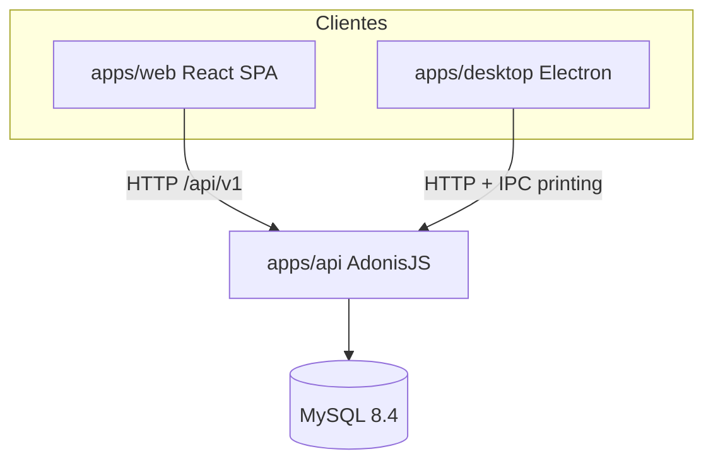

# Documentación oficial técnica — Nega POS

Referencia técnica **única y vigente** para desarrolladores. Derivada exclusivamente del código fuente del repositorio (`apps/`, migraciones, rutas, configuración). Última revisión contra el código: julio 2026.

> **Nota:** La carpeta `docs/` está descontinuada. No usar esos archivos como referencia; usar solo este documento y el código.

---

## Índice

1. [Resumen del sistema](#1-resumen-del-sistema)
2. [Arquitectura](#2-arquitectura)
3. [Stack tecnológico](#3-stack-tecnológico)
4. [Estructura del repositorio](#4-estructura-del-repositorio)
5. [Entornos de ejecución](#5-entornos-de-ejecución)
6. [Autenticación y seguridad](#6-autenticación-y-seguridad)
7. [Modelo de datos](#7-modelo-de-datos)
8. [Flujos de negocio (técnico)](#8-flujos-de-negocio-técnico)
9. [API REST — referencia](#9-api-rest--referencia)
10. [Frontend web](#10-frontend-web)
11. [App desktop e impresión](#11-app-desktop-e-impresión)
12. [Pruebas](#12-pruebas)
13. [Comandos de desarrollo](#13-comandos-de-desarrollo)

---

## 1. Resumen del sistema

**Nega POS** es un sistema de punto de venta y gestión de inventario con módulos administrativos. El monorepo implementa:

| Módulo | Descripción técnica |
|--------|---------------------|
| **Ventas** | Facturas en borrador → confirmación → descuento de stock (`SALE_OUT`), contado/crédito, devoluciones, modo rápido vs pedido |
| **Pedidos** | Órdenes con estados, líneas de catálogo, materiales asociados y transiciones con descuento de stock |
| **Catálogo** | Productos con/sin fórmula de materiales, categorías, precios y stock manual |
| **Inventario** | Materiales con movimientos (`inventory_movements`) y productos con movimientos (`product_inventory_movements`) |
| **Compras** | Borrador → ítems → confirmar → entrada `PURCHASE_IN` a materiales o productos |
| **Partners** | Clientes y proveedores con abonos de crédito y estado de cuenta |
| **Financiero** | Cuentas, monedas, métodos de pago, gastos operativos |
| **Máquinas** | Activos y gastos asociados (reparación, insumos, mantenimiento) |
| **Reportes** | Estado de cuenta consolidado por período |
| **Dashboard** | KPIs diarios, cierre, productos vendidos, gastos |
| **Impresión** | Tickets térmicos (factura, nota de despacho, comanda) vía Electron IPC |
| **Configuración** | Tasa de cambio, margen, datos generales del negocio, usuarios y permisos |

---

## 2. Arquitectura

Monorepo **pnpm** con tres aplicaciones y MySQL como persistencia.



**Flujo típico:**

1. El navegador o Electron carga la SPA React (`apps/web`).
2. La SPA llama a la API REST en `/api/v1` con cookies de sesión y token CSRF.
3. AdonisJS valida auth + permisos, ejecuta servicios de dominio y persiste en MySQL.
4. En desktop, la impresión sale por IPC de Electron (`printing:*`) sin pasar por la API.

---

## 3. Stack tecnológico

### Raíz (`package.json`)

| Componente | Versión / nota |
|------------|----------------|
| Node.js | ≥ 20 |
| pnpm | 9.15.4 (packageManager) |
| TypeScript | ^5.7.3 |
| ESLint + Prettier | ^9 / ^3 |

### API (`apps/api/package.json`)

| Paquete | Versión |
|---------|---------|
| @adonisjs/core | ^7.3.1 |
| @adonisjs/lucid | ^22.4.2 |
| @adonisjs/auth | ^10.1.0 |
| @adonisjs/session | ^8.1.0 |
| @adonisjs/shield | ^9.0.0 |
| @adonisjs/cors | ^3.0.0 |
| @adonisjs/drive | ^4.0.0 |
| @vinejs/vine | ^4.3.1 |
| mysql2 | ^3.14.0 |
| luxon | ^3.7.2 |
| Tests | Japa (@japa/runner, @japa/plugin-adonisjs) |

### Web (`apps/web/package.json`)

| Paquete | Versión |
|---------|---------|
| React | ^19.2.6 |
| react-router-dom | ^7.15.1 |
| @tanstack/react-query | ^5.100.14 |
| axios | ^1.16.1 |
| Vite | ^8.0.14 |
| Tailwind CSS | ^4.3.0 |
| zod | ^4.4.3 (solo frontend) |
| Tests | Vitest ^4.1.5 |

### Desktop (`apps/desktop/package.json`)

| Paquete | Versión |
|---------|---------|
| Electron | ^34.2.0 |
| electron-builder | ^25.1.8 |
| Versión app | 1.0.5 |

### Base de datos

- **MySQL 8.4** (imagen Docker `mysql:8.4`)

---

## 4. Estructura del repositorio

```
nega-pos/
├── apps/
│   ├── api/                 # Backend AdonisJS 6/7
│   │   ├── app/
│   │   │   ├── controllers/ # Controladores HTTP
│   │   │   ├── models/      # Modelos Lucid (27 entidades)
│   │   │   ├── services/    # Lógica de dominio
│   │   │   ├── permissions/ # Catálogo y mapeo ruta→permiso
│   │   │   ├── validators/  # Vine
│   │   │   └── transformers/
│   │   ├── database/
│   │   │   ├── migrations/  # 13 migraciones (1750000000001–13)
│   │   │   └── seeders/
│   │   └── start/
│   │       └── routes.ts    # Definición de rutas API
│   ├── web/                 # SPA React + Vite
│   │   └── src/
│   │       ├── features/    # Módulos por dominio
│   │       ├── pages/       # Páginas de rutas
│   │       └── routes/      # router.tsx
│   └── desktop/             # Electron
│       ├── electron/        # main.ts, preload, print-service
│       └── print-config.json
├── docker-compose.yml       # MySQL + API opcional
├── scripts/                 # dev-setup.ps1, reset-database.ps1
└── package.json             # Scripts del monorepo
```

---

## 5. Entornos de ejecución

### Local con Docker (MySQL)

```powershell
docker compose up -d mysql    # Solo BD → localhost:3306
# o
docker compose up -d          # MySQL + API en :3333
```

Credenciales alineadas con `apps/api/.env.example`: usuario `nega_pos`, BD `nega_pos`.

### Desarrollo en host

| Servicio | Puerto | Comando |
|----------|--------|---------|
| API | 3333 | `pnpm dev:api` |
| Web (Vite) | 5173 | `pnpm dev:web` |
| MySQL | 3306 | `pnpm dev:db` |

### Desktop

- Servidor estático embebido en `127.0.0.1:51740`
- Build: `pnpm build:desktop` o desarrollo: `pnpm dev:desktop`
- Configuración de impresión: `apps/desktop/print-config.json` (junto al ejecutable en producción)
- API remota: `apps/desktop/api-url.json` (URL de Railway u otro host)

### Variables de entorno relevantes

**API** (`apps/api/.env.example`):

| Variable | Propósito |
|----------|-----------|
| `APP_KEY` | Clave de aplicación Adonis |
| `PORT` / `HOST` | Puerto y bind (default 3333 / 0.0.0.0) |
| `SESSION_DRIVER` | `cookie` en dev |
| `SESSION_MAX_AGE` | Expiración por inactividad (ej. `365d`) |
| `DB_*` | Conexión MySQL |
| `FRONTEND_URL` | CORS web (ej. `http://localhost:5173`) |
| `DESKTOP_APP_ORIGIN` | CORS Electron (`http://127.0.0.1:51740`) |
| `ADMIN_EMAIL` / `ADMIN_PASSWORD` | Seeder de usuario admin |
| `DRIVE_DISK` / `STORAGE_LOCAL_PATH` | Archivos subidos (imágenes, facturas) |

**Web** (`apps/web/.env.example`):

| Variable | Propósito |
|----------|-----------|
| `VITE_API_URL` | URL base API sin `/api/v1` (ej. `http://localhost:3333`) |

---

## 6. Autenticación y seguridad

### Sesión

- Guard `web` de Adonis Auth con **cookies** (`SESSION_DRIVER=cookie`).
- Login: `POST /api/v1/auth/login` → establece cookie de sesión.
- Logout: `POST /api/v1/auth/logout` (requiere sesión).
- Perfil: `GET /api/v1/auth/me`.

### CSRF

- Token: `GET /api/v1/csrf` (público, sin auth).
- Las peticiones mutantes desde el frontend envían el token CSRF (Shield).

### Roles y permisos

**Roles** (`users.role`): `OPERATOR` | `ADMIN`.

- `ADMIN` tiene todos los permisos (`*`).
- `OPERATOR` tiene permisos granulares en `users.permissions` (JSON).

**Catálogo de permisos** (`apps/api/app/permissions/catalog.ts`, espejo en `apps/web/src/features/permissions/catalog.ts`):

| Grupo | Claves |
|-------|--------|
| dashboard | `dashboard.view` |
| ventas | `ventas.view`, `ventas.confirm`, `ventas.credit`, `ventas.returns` |
| customers | `customers.view`, `customers.edit`, `customers.payments` |
| suppliers | `suppliers.view`, `suppliers.edit`, `suppliers.payments` |
| catalog | `catalog.view`, `catalog.edit`, `catalog.pricing` |
| materials | `materials.view`, `materials.edit`, `materials.adjust` |
| machines | `machines.view`, `machines.edit` |
| purchases | `purchases.view`, `purchases.edit`, `purchases.confirm` |
| expenses | `expenses.view`, `expenses.edit` |
| reports | `reports.view` |
| settings | `settings.view`, `settings.edit` |
| users | `users.view`, `users.manage` |

**Middleware** (`permission_middleware.ts`): resuelve permiso por método + ruta (`route_permissions.ts`). Rutas no mapeadas → `deny`. Excepciones solo auth: `/auth/me`, `/auth/logout`.

---

## 7. Modelo de datos

13 migraciones en `apps/api/database/migrations/`. 27 modelos Lucid en `apps/api/app/models/`.

### Agrupación de tablas

#### Usuarios

| Tabla | Campos clave |
|-------|--------------|
| `users` | `email`, `password`, `name`, `role` (OPERATOR/ADMIN), `permissions` (JSON), `active` |

#### Partners

| Tabla | Campos clave |
|-------|--------------|
| `customers` | `name`, `phone`, `email`, `type` (WHITE_LABEL/CORPORATE/OTHER), `document`, `credit_days`, `active` |
| `suppliers` | `name`, `rif`, `phone`, `email`, `credit_days`, `active` |

#### Financiero

| Tabla | Campos clave |
|-------|--------------|
| `accounts` | `name`, `description`, `is_active` |
| `currencies` | `code` (PK), `name`, `rate_per_usd`, `is_active` |
| `payment_methods` | `code`, `name`, `is_active`, `sort_order` |
| `app_settings` | `key` (PK), valor JSON para tasa, margen, general |
| `customer_payments` | `customer_id`, `order_id?`, `sale_id?`, `amount_usd`, `payment_method_code`, `account_id` |
| `supplier_payments` | `supplier_id`, `purchase_id?`, `amount_usd`, … |
| `expenses` | `account_id`, `date`, `description`, `amount_usd`, `currency_code` |

#### Catálogo

| Tabla | Campos clave |
|-------|--------------|
| `categories` | `name`, `active`, `sort_order` |
| `formulas` | `name`, `active` |
| `formula_materials` | `formula_id`, `material_id`, `quantity` |
| `catalog_products` | `name`, `category`, `sale_unit`, `formula_id?`, `sale_price_usd`, `cost_usd`, `stock_quantity`, `minimum_stock`, `active` |

Unidades de venta: `UND`, `PAR`, `CAJ`, `ROL`, `SET`, `MTS`, `KG`.

#### Inventario

| Tabla | Campos clave |
|-------|--------------|
| `materials` | `code`, `name`, `category` (FABRIC/THREAD/…), `unit`, `minimum_stock`, `default_supplier_id`, precios, `active` |
| `inventory_movements` | `material_id`, `type`, `quantity`, refs a compra/pedido/venta |
| `product_inventory_movements` | `catalog_product_id`, `type`, `quantity`, refs |

**Tipos de movimiento — materiales:** `PURCHASE_IN`, `ORDER_OUT`, `MANUAL_ADJUSTMENT`, `MANUAL_CARGO`, `MANUAL_DESCARGO`, `REVERSAL_ADJUSTMENT`, `SALE_OUT`.

**Tipos de movimiento — productos:** `PURCHASE_IN`, `SALE_OUT`, `MANUAL_ADJUSTMENT`, `MANUAL_CARGO`, `MANUAL_DESCARGO`, `REVERSAL_ADJUSTMENT`.

#### Compras

| Tabla | Campos clave |
|-------|--------------|
| `purchases` | `supplier_id`, `account_id`, fechas, `invoice_number`, `status` (DRAFT/CONFIRMED/VOIDED), `is_credit`, totales USD/BS, saldos |
| `purchase_items` | `material_id?`, `catalog_product_id?`, cantidades y precios |

#### Pedidos

| Tabla | Campos clave |
|-------|--------------|
| `counters` | `scope` (PK), `value` — correlativos |
| `orders` | `code`, `customer_id?`, `guest_name`, `modality` (WHITE_LABEL/CORPORATE), `status`, `payment_type`, totales, fechas |
| `order_lines` | `catalog_product_id`, `quantity`, precios, `returned_quantity` |
| `order_materials` | `material_id`, `quantity_per_garment` |

**Estados de pedido:** `DRAFT` → `CONFIRMED` → `IN_PRODUCTION` → `DELIVERED`; también `CANCELLED`, `RETURNED`.

#### Ventas

| Tabla | Campos clave |
|-------|--------------|
| `sales` | `code`, `customer_id?`, `guest_name`, `billing_mode` (FAST/ORDER), `order_status` (PENDING/IN_PROCESS/DELIVERED), `payment_type`, `status` (DRAFT/COMPLETED/RETURNED), totales |
| `sale_lines` | `catalog_product_id?`, `material_id?`, `description`, cantidades y precios |

#### Máquinas

| Tabla | Campos clave |
|-------|--------------|
| `machines` | `name`, `type`, `brand`, `model`, `acquisition_cost`, `active` |
| `machine_expenses` | `machine_id`, `category` (REPAIR/SUPPLY/MAINTENANCE/OTHER), `amount`, `receipt_file` |

### Relaciones principales

```
customers ──< orders ──< order_lines ──> catalog_products
                └──< order_materials ──> materials
customers ──< sales ──< sale_lines ──> catalog_products | materials
suppliers ──< purchases ──< purchase_items ──> materials | catalog_products
formulas ──< formula_materials ──> materials
catalog_products ──> formulas (opcional)
materials ──< inventory_movements
catalog_products ──< product_inventory_movements
```

---

## 8. Flujos de negocio (técnico)

### Compras (`purchase_service.ts`)

1. **Crear borrador** (`status: DRAFT`) con proveedor y cuenta opcional.
2. **Agregar ítems** — material y/o producto de catálogo (productos con fórmula no admiten compra directa de stock).
3. **Confirmar** (`POST .../confirm`):
   - Requiere `invoice_number` y al menos un ítem.
   - Por cada ítem material: movimiento `PURCHASE_IN` + actualización de `last_purchase_price_usd`.
   - Por cada ítem producto sin fórmula: movimiento `PURCHASE_IN` en `product_inventory_movements` + `cost_usd`.
   - `status → CONFIRMED`; si es crédito, registra saldo en proveedor.
   - Tras confirmar compra, pedidos en `DRAFT` pendientes de material pueden pasar automáticamente a `IN_PRODUCTION` si hay stock suficiente.

### Catálogo y fórmulas

- Producto **con** `formula_id`: el stock de venta/pedido se descuenta de **materiales** según `formula_materials`, no de `stock_quantity`.
- Producto **sin** fórmula: stock en `catalog_products.stock_quantity` vía `product_inventory_movements`.
- Ajustes manuales: `POST catalog-products/:id/adjustment` y `POST materials/:id/adjustment`.

### Pedidos (`order_service.ts` + `order_state_machine.ts`)

**Transiciones permitidas:**

| Desde | Hacia |
|-------|-------|
| DRAFT | CONFIRMED, DELIVERED, CANCELLED |
| CONFIRMED | IN_PRODUCTION, CANCELLED |
| IN_PRODUCTION | DELIVERED, CANCELLED |
| DELIVERED | — |
| CANCELLED / RETURNED | — |

**Efectos por transición:**

- **DRAFT → CONFIRMED**: valida cliente/invitado y descripción; congela costos; descuenta stock de productos de líneas; aplica pago si contado.
- **DRAFT → DELIVERED**: igual que confirmar + pasa a producción (descuento de materiales vía fórmulas/`order_materials`).
- **CONFIRMED → IN_PRODUCTION**: descuenta materiales (`ORDER_OUT`); puede advertir si falta stock (`force` opcional).
- **→ CANCELLED** desde CONFIRMED/IN_PRODUCTION: revierte movimientos y stock de productos.

### Ventas (`sale_service.ts`)

1. **Borrador** (`DRAFT`): líneas de catálogo o material, cliente opcional.
2. **Confirmar** (`POST .../confirm`):
   - Genera `code`, `status → COMPLETED`, `sold_at` / `confirmed_at`.
   - `billing_mode FAST` → `order_status DELIVERED`; `ORDER` → `order_status PENDING`.
   - Descuenta stock (materiales vía fórmula o producto directo).
   - Aplica método de pago y saldo si es crédito.
3. **Transición de pedido de venta** (`billing_mode ORDER`): `PENDING → IN_PROCESS → DELIVERED` (solo ventas completadas).
4. **Devolución** (`POST .../return`): parcial o total; revierte stock y actualiza `RETURNED`.

### Reportes (`report_service.ts`)

- **Estado de cuenta consolidado** (`GET /reports/account-statement`): agrega ventas, compras, gastos, gastos de máquina, abonos de clientes/proveedores en un rango de fechas, con filtros por cuenta, moneda de visualización y tipos.

### Dashboard (`dashboard_service.ts`)

- Resumen del día: productos vendidos, montos, crédito, gastos, ganancia estimada.
- Endpoints adicionales: overview, ventas diarias por producto, gastos del día, cierre diario.
- Alertas de bajo stock en materiales y productos.

---

## 9. API REST — referencia

**Prefijo:** `/api/v1`  
**Total de rutas definidas:** 145 (incluye `/health` fuera del prefijo).

**Leyenda auth:**

- **Público** — sin sesión
- **Auth** — sesión requerida, sin permiso específico
- **Permiso** — sesión + permiso indicado (ADMIN bypass)

### Sistema

| Método | Ruta | Auth | Controlador |
|--------|------|------|-------------|
| GET | `/health` | Público | `Health.show` |

### Auth y CSRF

| Método | Ruta | Auth | Controlador |
|--------|------|------|-------------|
| GET | `/api/v1/csrf` | Público | `CsrfController.show` |
| POST | `/api/v1/auth/login` | Público | `Auth.login` |
| POST | `/api/v1/auth/logout` | Auth | `Auth.logout` |
| GET | `/api/v1/auth/me` | Auth | `Auth.me` |

### Usuarios (`users.*`)

| Método | Ruta | Permiso | Controlador |
|--------|------|---------|-------------|
| GET | `/api/v1/users` | `users.view` | `UsersController.index` |
| GET | `/api/v1/users/:id` | `users.view` | `UsersController.show` |
| POST | `/api/v1/users` | `users.manage` | `UsersController.store` |
| PUT | `/api/v1/users/:id` | `users.manage` | `UsersController.update` |
| PATCH | `/api/v1/users/:id/active` | `users.manage` | `UsersController.updateActive` |

### Clientes (`customers.*`)

| Método | Ruta | Permiso | Controlador |
|--------|------|---------|-------------|
| GET | `/api/v1/customers` | `customers.view` | `Customers.index` |
| GET | `/api/v1/customers/:id` | `customers.view` | `Customers.show` |
| GET | `/api/v1/customers/:id/account-statement` | `customers.view` | `Customers.accountStatement` |
| POST | `/api/v1/customers` | `customers.edit` | `Customers.store` |
| PUT | `/api/v1/customers/:id` | `customers.edit` | `Customers.update` |
| DELETE | `/api/v1/customers/:id` | `customers.edit` | `Customers.destroy` |
| POST | `/api/v1/customers/:id/image` | `customers.edit` | `Customers.uploadImage` |
| GET | `/api/v1/customers/:id/image` | `customers.view` | `Customers.downloadImage` |
| DELETE | `/api/v1/customers/:id/image` | `customers.edit` | `Customers.deleteImage` |
| POST | `/api/v1/customers/:id/payments` | `customers.payments` | `Customers.storePayment` |

### Pedidos (`ventas.*`)

| Método | Ruta | Permiso | Controlador |
|--------|------|---------|-------------|
| GET | `/api/v1/orders` | `ventas.view` | `Orders.index` |
| GET | `/api/v1/orders/:id` | `ventas.view` | `Orders.show` |
| POST | `/api/v1/orders` | `ventas.confirm` | `Orders.store` |
| PUT | `/api/v1/orders/:id` | `ventas.confirm` | `Orders.update` |
| DELETE | `/api/v1/orders/:id` | `ventas.confirm` | `Orders.destroy` |
| POST | `/api/v1/orders/:id/transition` | `ventas.confirm` | `Orders.transition` |
| POST | `/api/v1/orders/:id/return` | `ventas.returns` | `Orders.devolver` |
| POST | `/api/v1/orders/:id/materials` | `ventas.confirm` | `Orders.storeMaterial` |
| PUT | `/api/v1/orders/:id/materials/:pmId` | `ventas.confirm` | `Orders.updateMaterial` |
| DELETE | `/api/v1/orders/:id/materials/:pmId` | `ventas.confirm` | `Orders.destroyMaterial` |
| POST | `/api/v1/orders/:id/lines` | `ventas.confirm` | `Orders.storeLine` |
| PUT | `/api/v1/orders/:id/lines/:lineId` | `ventas.confirm` | `Orders.updateLine` |
| DELETE | `/api/v1/orders/:id/lines/:lineId` | `ventas.confirm` | `Orders.destroyLine` |
| GET | `/api/v1/orders/:id/budget` | `ventas.view` | `Orders.budget` |
| GET | `/api/v1/orders/:id/material-availability` | `ventas.view` | `Orders.materialAvailability` |
| POST | `/api/v1/orders/:id/reference` | `ventas.confirm` | `Orders.uploadReferencia` |
| GET | `/api/v1/orders/:id/reference` | `ventas.view` | `Orders.downloadReferencia` |

### Ventas / facturación (`ventas.*`)

| Método | Ruta | Permiso | Controlador |
|--------|------|---------|-------------|
| GET | `/api/v1/sales/next-code` | `ventas.view` | `SalesController.nextCode` |
| GET | `/api/v1/sales` | `ventas.view` | `SalesController.index` |
| GET | `/api/v1/sales/:id` | `ventas.view` | `SalesController.show` |
| POST | `/api/v1/sales` | `ventas.confirm` | `SalesController.store` |
| PUT | `/api/v1/sales/:id` | `ventas.confirm` | `SalesController.update` |
| DELETE | `/api/v1/sales/:id` | `ventas.confirm` | `SalesController.destroy` |
| POST | `/api/v1/sales/:id/confirm` | `ventas.confirm` | `SalesController.confirm` |
| POST | `/api/v1/sales/:id/transition` | `ventas.confirm` | `SalesController.transition` |
| POST | `/api/v1/sales/:id/return` | `ventas.returns` | `SalesController.returnSale` |

### Catálogo (`catalog.*`)

| Método | Ruta | Permiso | Controlador |
|--------|------|---------|-------------|
| GET | `/api/v1/catalog-products` | `catalog.view` | `CatalogProductsController.index` |
| GET | `/api/v1/catalog-products/:id` | `catalog.view` | `CatalogProductsController.show` |
| POST | `/api/v1/catalog-products` | `catalog.edit` | `CatalogProductsController.store` |
| PUT | `/api/v1/catalog-products/:id` | `catalog.edit` | `CatalogProductsController.update` |
| DELETE | `/api/v1/catalog-products/:id` | `catalog.edit` | `CatalogProductsController.destroy` |
| POST | `/api/v1/catalog-products/apply-profit-margin` | `catalog.pricing` | `CatalogProductsController.applyProfitMargin` |
| POST | `/api/v1/catalog-products/:id/adjustment` | `catalog.edit` | `CatalogProductsController.ajuste` |
| POST | `/api/v1/catalog-products/:id/image` | `catalog.edit` | `CatalogProductsController.uploadImage` |
| GET | `/api/v1/catalog-products/:id/image` | `catalog.view` | `CatalogProductsController.downloadImage` |
| DELETE | `/api/v1/catalog-products/:id/image` | `catalog.edit` | `CatalogProductsController.deleteImage` |

### Fórmulas (`catalog.*`)

| Método | Ruta | Permiso | Controlador |
|--------|------|---------|-------------|
| GET | `/api/v1/formulas` | `catalog.view` | `FormulasController.index` |
| GET | `/api/v1/formulas/:id` | `catalog.view` | `FormulasController.show` |
| POST | `/api/v1/formulas` | `catalog.edit` | `FormulasController.store` |
| PUT | `/api/v1/formulas/:id` | `catalog.edit` | `FormulasController.update` |
| DELETE | `/api/v1/formulas/:id` | `catalog.edit` | `FormulasController.destroy` |
| GET | `/api/v1/formulas/:id/materials` | `catalog.view` | `FormulasController.getMaterials` |
| PUT | `/api/v1/formulas/:id/materials` | `catalog.edit` | `FormulasController.updateMaterials` |

### Categorías (`catalog.*`)

| Método | Ruta | Permiso | Controlador |
|--------|------|---------|-------------|
| GET | `/api/v1/categories` | `catalog.view` | `CategoriesController.index` |
| POST | `/api/v1/categories` | `catalog.edit` | `CategoriesController.store` |
| PUT | `/api/v1/categories/:id` | `catalog.edit` | `CategoriesController.update` |
| DELETE | `/api/v1/categories/:id` | `catalog.edit` | `CategoriesController.destroy` |

### Materiales (`materials.*`)

| Método | Ruta | Permiso | Controlador |
|--------|------|---------|-------------|
| GET | `/api/v1/materials` | `materials.view` | `Materials.index` |
| GET | `/api/v1/materials/:id` | `materials.view` | `Materials.show` |
| POST | `/api/v1/materials` | `materials.edit` | `Materials.store` |
| PUT | `/api/v1/materials/:id` | `materials.edit` | `Materials.update` |
| DELETE | `/api/v1/materials/:id` | `materials.edit` | `Materials.destroy` |
| POST | `/api/v1/materials/:id/adjustment` | `materials.adjust` | `Materials.ajuste` |
| GET | `/api/v1/materials/:id/price-history` | `materials.view` | `Materials.historialPrecios` |
| POST | `/api/v1/materials/:id/image` | `materials.edit` | `Materials.uploadImage` |
| GET | `/api/v1/materials/:id/image` | `materials.view` | `Materials.downloadImage` |
| DELETE | `/api/v1/materials/:id/image` | `materials.edit` | `Materials.deleteImage` |

### Proveedores (`suppliers.*`)

| Método | Ruta | Permiso | Controlador |
|--------|------|---------|-------------|
| GET | `/api/v1/suppliers` | `suppliers.view` | `Suppliers.index` |
| GET | `/api/v1/suppliers/:id` | `suppliers.view` | `Suppliers.show` |
| GET | `/api/v1/suppliers/:id/account-statement` | `suppliers.view` | `Suppliers.accountStatement` |
| POST | `/api/v1/suppliers` | `suppliers.edit` | `Suppliers.store` |
| PUT | `/api/v1/suppliers/:id` | `suppliers.edit` | `Suppliers.update` |
| DELETE | `/api/v1/suppliers/:id` | `suppliers.edit` | `Suppliers.destroy` |
| POST | `/api/v1/suppliers/:id/image` | `suppliers.edit` | `Suppliers.uploadImage` |
| GET | `/api/v1/suppliers/:id/image` | `suppliers.view` | `Suppliers.downloadImage` |
| DELETE | `/api/v1/suppliers/:id/image` | `suppliers.edit` | `Suppliers.deleteImage` |
| POST | `/api/v1/suppliers/:id/payments` | `suppliers.payments` | `Suppliers.storePayment` |

### Compras (`purchases.*`)

| Método | Ruta | Permiso | Controlador |
|--------|------|---------|-------------|
| GET | `/api/v1/purchases/summary` | `purchases.view` | `Purchases.summary` |
| GET | `/api/v1/purchases` | `purchases.view` | `Purchases.index` |
| GET | `/api/v1/purchases/:id` | `purchases.view` | `Purchases.show` |
| POST | `/api/v1/purchases` | `purchases.edit` | `Purchases.store` |
| PUT | `/api/v1/purchases/:id` | `purchases.edit` | `Purchases.update` |
| DELETE | `/api/v1/purchases/:id` | `purchases.edit` | `Purchases.destroy` |
| POST | `/api/v1/purchases/:id/confirm` | `purchases.confirm` | `Purchases.confirmar` |
| POST | `/api/v1/purchases/:id/return` | `purchases.edit` | `Purchases.devolver` |
| POST | `/api/v1/purchases/:id/invoice` | `purchases.edit` | `Purchases.uploadFactura` |
| GET | `/api/v1/purchases/:id/invoice` | `purchases.view` | `Purchases.downloadFactura` |
| POST | `/api/v1/purchases/:id/items` | `purchases.edit` | `Purchases.storeItem` |
| PUT | `/api/v1/purchases/:id/items/:itemId` | `purchases.edit` | `Purchases.updateItem` |
| DELETE | `/api/v1/purchases/:id/items/:itemId` | `purchases.edit` | `Purchases.destroyItem` |

### Gastos (`expenses.*`)

| Método | Ruta | Permiso | Controlador |
|--------|------|---------|-------------|
| GET | `/api/v1/expenses/summary` | `expenses.view` | `ExpensesController.summary` |
| GET | `/api/v1/expenses` | `expenses.view` | `ExpensesController.index` |
| POST | `/api/v1/expenses` | `expenses.edit` | `ExpensesController.store` |
| PUT | `/api/v1/expenses/:id` | `expenses.edit` | `ExpensesController.update` |
| DELETE | `/api/v1/expenses/:id` | `expenses.edit` | `ExpensesController.destroy` |

### Máquinas (`machines.*`)

| Método | Ruta | Permiso | Controlador |
|--------|------|---------|-------------|
| GET | `/api/v1/machines` | `machines.view` | `Machines.index` |
| GET | `/api/v1/machines/:id` | `machines.view` | `Machines.show` |
| POST | `/api/v1/machines` | `machines.edit` | `Machines.store` |
| PUT | `/api/v1/machines/:id` | `machines.edit` | `Machines.update` |
| DELETE | `/api/v1/machines/:id` | `machines.edit` | `Machines.destroy` |
| GET | `/api/v1/machines/:id/expenses` | `machines.view` | `Machines.indexExpenses` |
| POST | `/api/v1/machines/:id/expenses` | `machines.edit` | `Machines.storeExpense` |

### Gastos de máquina (`machines.*`)

| Método | Ruta | Permiso | Controlador |
|--------|------|---------|-------------|
| GET | `/api/v1/machine-expenses` | `machines.view` | `MachineExpenses.index` |
| PUT | `/api/v1/machine-expenses/:id` | `machines.edit` | `MachineExpenses.update` |
| DELETE | `/api/v1/machine-expenses/:id` | `machines.edit` | `MachineExpenses.destroy` |
| POST | `/api/v1/machine-expenses/:id/receipt` | `machines.edit` | `MachineExpenses.uploadComprobante` |
| GET | `/api/v1/machine-expenses/:id/receipt` | `machines.view` | `MachineExpenses.downloadComprobante` |

### Cuentas (`purchases.view` / `settings.edit`)

| Método | Ruta | Permiso | Controlador |
|--------|------|---------|-------------|
| GET | `/api/v1/accounts` | `purchases.view` | `AccountsController.index` |
| GET | `/api/v1/accounts/:id` | `purchases.view` | `AccountsController.show` |
| POST | `/api/v1/accounts` | `settings.edit` | `AccountsController.store` |
| PUT | `/api/v1/accounts/:id` | `settings.edit` | `AccountsController.update` |
| DELETE | `/api/v1/accounts/:id` | `settings.edit` | `AccountsController.destroy` |

### Monedas (`settings.*`)

| Método | Ruta | Permiso | Controlador |
|--------|------|---------|-------------|
| GET | `/api/v1/currencies` | `settings.view` | `CurrenciesController.index` |
| POST | `/api/v1/currencies` | `settings.edit` | `CurrenciesController.store` |
| PUT | `/api/v1/currencies/:code` | `settings.edit` | `CurrenciesController.update` |
| DELETE | `/api/v1/currencies/:code` | `settings.edit` | `CurrenciesController.destroy` |

### Métodos de pago (`settings.*`)

| Método | Ruta | Permiso | Controlador |
|--------|------|---------|-------------|
| GET | `/api/v1/payment-methods` | `settings.view` | `PaymentMethodsController.index` |
| POST | `/api/v1/payment-methods` | `settings.edit` | `PaymentMethodsController.store` |
| PUT | `/api/v1/payment-methods/:code` | `settings.edit` | `PaymentMethodsController.update` |
| DELETE | `/api/v1/payment-methods/:code` | `settings.edit` | `PaymentMethodsController.destroy` |

### Reportes (`reports.view`)

| Método | Ruta | Permiso | Controlador |
|--------|------|---------|-------------|
| GET | `/api/v1/reports/account-statement` | `reports.view` | `ReportsController.accountStatement` |

### Dashboard (`dashboard.view`)

| Método | Ruta | Permiso | Controlador |
|--------|------|---------|-------------|
| GET | `/api/v1/dashboard/summary` | `dashboard.view` | `Dashboard.resumen` |
| GET | `/api/v1/dashboard/overview` | `dashboard.view` | `Dashboard.overview` |
| GET | `/api/v1/dashboard/daily-product-sales` | `dashboard.view` | `Dashboard.dailyProductSales` |
| GET | `/api/v1/dashboard/daily-expenses` | `dashboard.view` | `Dashboard.dailyExpenses` |
| GET | `/api/v1/dashboard/daily-closing` | `dashboard.view` | `Dashboard.dailyClosing` |

### Settings (`settings.*`)

| Método | Ruta | Permiso | Controlador |
|--------|------|---------|-------------|
| GET | `/api/v1/settings/exchange-rate` | `settings.view` | `SettingsController.getExchangeRate` |
| PUT | `/api/v1/settings/exchange-rate` | `settings.edit` | `SettingsController.updateExchangeRate` |
| GET | `/api/v1/settings/profit-margin` | `settings.view` | `SettingsController.getProfitMargin` |
| PUT | `/api/v1/settings/profit-margin` | `settings.edit` | `SettingsController.updateProfitMargin` |
| GET | `/api/v1/settings/general` | `settings.view` | `SettingsController.getGeneral` |
| PUT | `/api/v1/settings/general` | `settings.edit` | `SettingsController.updateGeneral` |
| POST | `/api/v1/settings/general/logo` | `settings.edit` | `SettingsController.uploadLogo` |
| GET | `/api/v1/settings/general/logo` | `settings.view` | `SettingsController.downloadLogo` |
| DELETE | `/api/v1/settings/general/logo` | `settings.edit` | `SettingsController.deleteLogo` |

---

## 10. Frontend web

### Rutas (`apps/web/src/routes/router.tsx`)

| Ruta | Página / comportamiento |
|------|-------------------------|
| `/login` | Login (solo invitados) |
| `/` | Redirige a `/dashboard` |
| `/dashboard` | Panel principal |
| `/dashboard/productos-vendidos-hoy` | Ventas diarias por producto |
| `/dashboard/gastos-del-dia` | Gastos del día |
| `/dashboard/cierre-diario` | Cierre diario |
| `/customers` | Listado clientes |
| `/customers/:id` | Detalle cliente |
| `/customers/:id/cuenta` | Estado de cuenta cliente |
| `/ventas` | Hub ventas (POS + historial pedidos/facturas) |
| `/ventas/:id` | Detalle factura |
| `/orders/:id` | Detalle pedido |
| `/productos` | Catálogo |
| `/productos/:id` | Detalle producto |
| `/productos/materiales` | Materiales |
| `/productos/materiales/:id` | Detalle material |
| `/purchases` | Compras |
| `/purchases/:id` | Detalle compra |
| `/suppliers` | Proveedores |
| `/suppliers/:id/cuenta` | Estado de cuenta proveedor |
| `/machines` | Máquinas |
| `/machines/:id` | Detalle máquina |
| `/reportes` | Reportes |
| `/reportes/movimientos/:category` | Movimientos por categoría |
| `/users` | Usuarios |
| `/settings` | Configuración (tabs: general, ventas, formatos, compras, etc.) |

Rutas legacy redirigen: `/orders` → `/ventas`, `/materials` → `/productos/materiales`.

### Módulos `features/*`

Cada feature encapsula servicios API (axios), hooks TanStack Query, componentes y tipos:

| Feature | API principal |
|---------|---------------|
| `auth` | login, logout, me, CSRF |
| `ventas` | sales, orders |
| `customers` | customers, payments |
| `suppliers` | suppliers, payments |
| `catalog` / `formulas` | catalog-products, formulas, categories |
| `materials` | materials |
| `purchases` | purchases |
| `dashboard` | dashboard/* |
| `reports` | reports/account-statement |
| `settings` | settings/*, payment-methods |
| `users` | users |
| `printing` | render local + IPC desktop |
| `permissions` | catálogo espejo para UI |
| `payment-methods` | payment-methods |
| `branding` | tema desde settings general |

### Estado y borradores locales

- **TanStack Query**: caché servidor, invalidación tras mutaciones.
- **Carrito de ventas**: `sessionStorage` vía `ventas-cart-draft.ts` — persiste borrador del POS entre recargas de pestaña.
- **Formatos de impresión**: leídos/escritos en desktop (`print-config.json`); en web solo preview y edición de plantillas cuando corre en Electron.

---

## 11. App desktop e impresión

### Electron (`apps/desktop/electron/`)

- **main.ts**: servidor HTTP local en `127.0.0.1:51740` sirve `web/dist`; proxy de API configurable.
- **preload.ts**: expone `window.electronAPI.printing` al renderer.
- **print-service.ts**: lista impresoras, lee/escribe config, imprime HTML con dimensiones térmicas (ancho ~78 mm, altura dinámica, DPI ajustado).

### IPC

| Canal | Función |
|-------|---------|
| `printing:listPrinters` | Lista dispositivos |
| `printing:getConfig` | Lee `print-config.json` |
| `printing:saveConfig` | Persiste configuración |
| `printing:printHtml` | Imprime HTML renderizado |

### Render de documentos (`apps/web/src/features/printing/`)

- **Tipos de documento:** `invoice`, `deliveryNote`, `comanda`.
- **Motor de plantillas:** `format-template-engine.ts` con placeholders (`{{sale.lines}}`, `{{business.header}}`, etc.).
- **Plantillas builtin:** factura, nota de despacho, comanda (sincronizadas con `print-config.json`).
- **Comportamiento** (`behavior` en config): imprimir al confirmar venta, comanda por fórmula, routing por categoría (`categoryRouting`).

---

## 12. Pruebas

### API (Japa)

```powershell
cd apps/api
node ace test
```

- Entorno: `NODE_ENV=test`, carga `apps/api/.env.test`.
- Base de datos de tests: **`nega_pos_test`** (nunca `nega_pos` de desarrollo).
- `SESSION_DRIVER=memory` en tests.
- Suites funcionales en `apps/api/tests/functional/` (ventas, compras, pedidos, dashboard, inventario integrado, etc.).

### Web (Vitest)

```powershell
cd apps/web
pnpm test
```

- Tests unitarios en features (ej. `ventas-cart-draft.test.ts`, `report-period.test.ts`, `render-document.test.ts`).

---

## 13. Comandos de desarrollo

### Monorepo (raíz)

| Comando | Acción |
|---------|--------|
| `pnpm dev:db` | Levanta MySQL (Docker) |
| `pnpm dev:api` | API en modo desarrollo (HMR) |
| `pnpm dev:web` | Vite dev server |
| `pnpm dev:setup` | Script inicial (`scripts/dev-setup.ps1`) |
| `pnpm dev:reset-db` | Reset BD (`scripts/reset-database.ps1`) |
| `pnpm dev:desktop` | Build web + Electron dev |
| `pnpm build:desktop` | Build web + empaquetado Windows |
| `pnpm lint` / `pnpm typecheck` | Calidad en todos los workspaces |

### API (Ace frecuentes)

```powershell
cd apps/api
node ace migration:run
node ace migration:rollback
node ace db:seed
node ace serve --hmr
node ace test
node ace generate:key
```

### Docker API + migraciones

El servicio `api` en `docker-compose.yml` ejecuta `migration:run --force` al arrancar y expone `:3333`.

---

*Documento generado a partir del código en `apps/api`, `apps/web`, `apps/desktop` y configuración del repositorio.*
